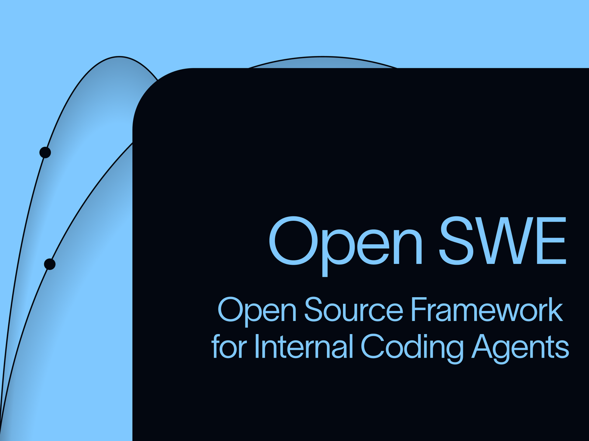

# 开源 AI 软件工程师，开始从 demo 走向工程化

最近 GitHub 上一个项目冲得很快：**open-swe**。

如果只看表面，你会觉得它无非又是一个“AI 写代码”的项目。

但它真正值得写的，不是又多了一个 coding agent，而是它代表了一种很明确的趋势：

**AI 编程这件事，正在从单次演示和即时问答，往真正可接入团队工作流的工程系统走。**

这也是为什么 open-swe 这次能火。

因为它不只是想让 AI 帮你写几行代码。

它想做的是另一件更重的事：

**把 AI 变成一个能在企业内部持续接任务、读上下文、开沙箱、调工具、提 PR、回 Slack、写 Linear 评论的异步软件工程代理。**

## 以前大家迷恋的是“AI 会写代码”

过去一段时间，AI 编程产品最抓眼球的地方，其实都差不多。

无非是：

- 会补全
- 会改 bug
- 会读仓库
- 会帮你解释代码
- 会根据一句 prompt 改几个文件

这些能力当然有用，而且最开始确实很震撼。

但问题是，真到了团队和公司内部，大家很快就会发现：

**会写代码，不等于能进入工程系统。**

企业内部真正麻烦的，从来不只是“把代码写出来”。

而是：

- 这个任务从哪里来
- 它有没有上下文
- 它在什么权限边界里运行
- 它会不会改坏别的东西
- 它改完之后怎么验证
- 它怎么把结果回到原来的协作链路里

说白了，真正难的不是让 AI 回答一个 prompt。

而是让 AI 进入一个组织内部已经存在的工作流。

## open-swe 为什么值钱

open-swe 的价值，就在于它不是把“AI 写代码”继续做成一个更花哨的聊天框。

它更像是在把一套企业内部 coding agent 的架构拆开给你看。

从公开信息看，它重点押的是这几个点：

- **隔离沙箱**：每个任务在独立环境里跑，出错也不至于把主环境炸掉
- **多入口接入**：可以从 Slack、Linear、GitHub 这些真实协作入口发起
- **子代理编排**：复杂任务可以拆成多个子任务并行推进
- **自动提 PR**：不是停在“改完了”，而是直接进入代码协作流程
- **上下文注入**：会把 issue、评论、规则文件等信息喂进去，不是盲干

这几个点放在一起，味道就完全不一样了。

因为这已经不是“一个聪明助手”。

更像是一个开始能进入工程组织的执行系统。

## 这说明 AI 编程真正开始进入工程化阶段了

我觉得 open-swe 最值得高看一眼的，不是它又多会了几个工具。

而是它代表的方向变了。

以前很多 AI 编程项目，更像是在证明：

“你看，AI 已经能写代码了。”

但今天这个阶段，市场其实已经不太缺这个证明了。

大家已经知道 AI 会写代码。

现在真正缺的，是另一种东西：

**AI 到底能不能被放进真实软件团队的协作链条里。**

能不能接单。

能不能理解上下游。

能不能在规则里行动。

能不能在出错时被兜住。

能不能最后把结果变成一条 PR，而不是一句“我已经帮你改好了”。

这就是工程化和 demo 的区别。

demo 追求的是惊艳。

工程化追求的是可接、可管、可复用、可维护。

而 open-swe 这次火，恰恰说明市场开始更在意后者了。

## 真正开始值钱的，不再只是模型，而是系统架构

这也是很多人最容易看漏的一点。

很多人还习惯用旧思路看 AI 编程，总觉得最后拼的就是模型能力。

谁更聪明，谁上下文更长，谁写得更准，谁就赢。

但 open-swe 这种项目越来越火，恰恰说明：

**下一阶段真正拉开差距的，已经不只是模型，而是整套系统怎么搭。**

模型只是大脑。

但工程世界要的，从来不是一个只有大脑的东西。

它还需要：

- 边界
- 记忆
- 权限
- 上下文
- 工具
- 调度
- 协作入口
- 失败恢复
- 结果回写

没有这些，模型再强，也很难长期跑在组织内部。

所以 open-swe 火，不只是因为大家又在追 agent。

而是因为越来越多人开始意识到：

**AI 编程真正难的地方，不在“会不会写”，而在“能不能融进软件团队的操作系统”。**

## 为什么这件事会越来越重要

因为企业内部的 AI 编程竞争，接下来一定会更重。

一开始，大家会先买一个 AI 编程工具，用来提效。

但越往后走，大家越会发现：

单点提效不够。

真正大的价值，在于它能不能直接接住组织内部不断流进来的任务。

比如：

- 需求单
- bug 单
- review 评论
- Slack 讨论
- Linear issue
- GitHub PR 反馈

如果 AI 只能在聊天框里等你一句句喂，它的上限其实很快就到了。

但如果它能在这些真实入口里直接接任务，然后进入沙箱执行，再把结果回到协作系统里，它的价值就完全不一样了。

这已经不是“帮你写代码”。

而是在开始接你团队里的流程性工作。

## 最后一句

open-swe 这次真正值得注意的，不是开源社区又冒出来一个新的 coding agent。

而是 AI 编程这条线，开始明显从“能不能写代码”进入“能不能进入工程组织”的阶段了。

以前大家比的是：

- 谁更聪明
- 谁写得更快
- 谁改得更多

接下来大家会越来越在意的是：

- 谁更能接工作流
- 谁更能在边界内跑
- 谁更能把结果送回协作系统
- 谁更像一个真正能持续工作的软件工程代理

这意味着 AI 编程的竞争，已经不只是模型战了。

它正在变成一场更重的系统战、流程战和工程战。

而 open-swe 这种项目之所以会火，不是因为它让 AI 看起来更魔法了。

恰恰相反。

是因为它让 AI 离真实软件团队的工作方式，更近了一步。

这才是它真正值钱的地方。

以上，既然看到这里了，如果觉得不错，随手点个赞、在看、转发三连吧，如果想第一时间收到推送，也可以给我个星标⭐～谢谢你看我的文章，我们，下次再见。
