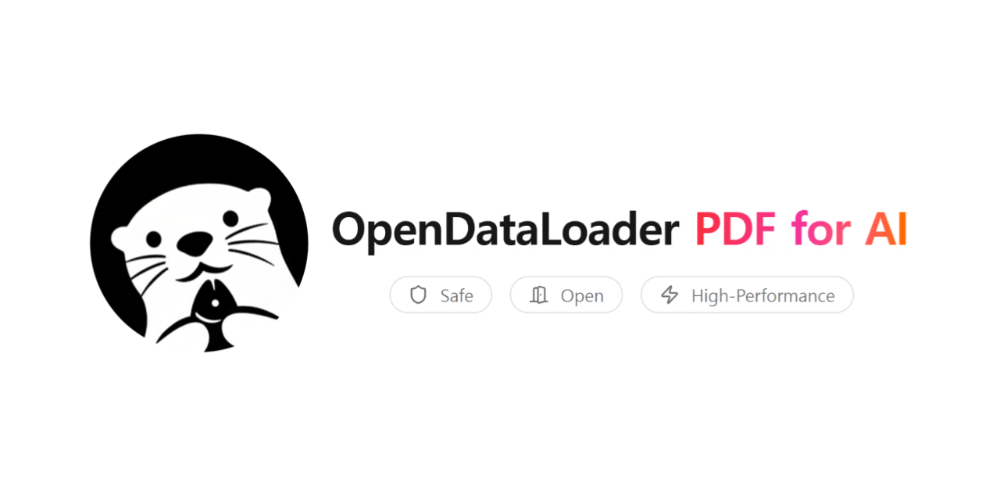
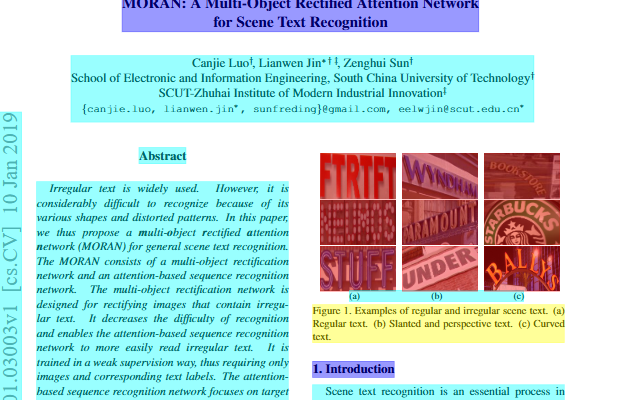
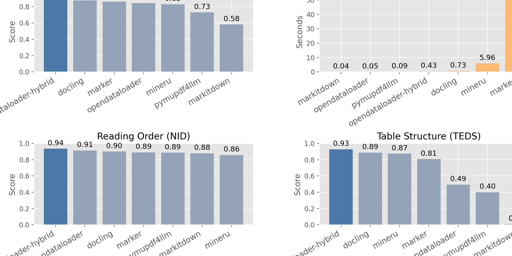
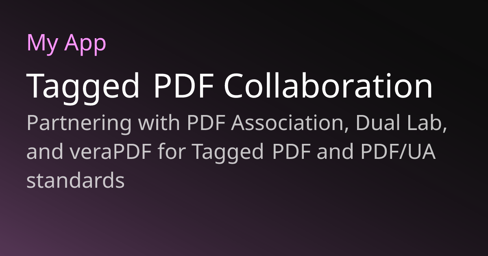

# AI 下半场真正抢的，不是模型，而是 PDF 和文档入口

最近 GitHub 上冲得最猛的项目之一，不是新模型，也不是新聊天机器人。

而是一个看起来很“基础设施”的东西：**opendataloader-pdf**。

如果只看名字，你可能会觉得这不过是又一个 PDF 解析工具。

但它真正值得写的，不是“能不能把 PDF 转出来”，而是它踩中了 AI 落地里一个越来越现实的痛点：

**模型已经很多了，但真正能喂给模型的高质量企业文档，还是太少。**

说得更直接一点，AI 下半场真正抢的，可能不是谁又发了一个更强模型。

而是谁先把最难啃、最脏、最复杂的文档入口吃下来。

## 为什么 PDF 这件事会突然变得这么重要

因为现实世界里的知识，并不是整整齐齐躺在数据库里等 AI 去读。

真正影响企业效率的东西，很多都埋在 PDF 里：

- 合同
- 财报
- 研究报告
- 产品手册
- 医疗文档
- 扫描件
- 发票与表单
- 历史档案

而 PDF 这种格式，恰恰是最让 AI 难受的一种东西。

它对人类看起来很正常。

但对模型来说，问题很多：

- 阅读顺序容易乱
- 表格容易碎
- 多栏布局容易错
- 图片和文字关系容易断
- 扫描件还得先 OCR
- 复杂页面经常一抽就废

这就导致一个尴尬事实：

**很多公司嘴上说在做 AI，实际上第一步就卡死在“文档根本喂不进去”。**

所以 PDF 这件事别看土，真到落地阶段，它反而越来越像一个硬门槛。

## opendataloader-pdf 火，不是因为它会转文件，而是因为它更像一条入口管道

这也是我觉得这个项目最值得写的地方。

很多人会低估这类项目，因为名字看起来不像那种很炸的 AI 产品。

但它真正值钱的不是“解析”两个字。

而是它在做一件更底层的事：

**把原本不适合 AI 直接使用的 PDF，尽量变成 AI 能真正消费的结构化输入。**

比如：

- Markdown
- JSON
- HTML
- 带坐标的结构化元素
- 能做引用定位的 bounding boxes

这意味着它不只是把文档“拆出来”。

而是在给 RAG、知识库、企业搜索、审计系统、自动问答、文档理解这些上层能力修路。

这条路一旦修通，后面的价值就很大。

## 现在真正值钱的，不是“能不能识别 PDF”，而是“能不能稳定识别复杂 PDF”

这是重点。

因为简单 PDF 识别这件事，早就不是新鲜事了。

真正难的是复杂文档：

- 多栏论文
- 边框不清楚的表格
- 数学公式
- 图文混排
- 扫描件
- 非英文文档
- 有水印、页眉页脚、噪声的旧资料

这些东西一复杂，很多工具就会开始翻车。

所以 opendataloader-pdf 这次能冲起来，很大一个原因是它在公开信息里把自己压在了一个更硬的点上：

**不是泛泛地说自己能解析 PDF，而是强调准确率、表格能力、OCR、复杂页面和 benchmark。**

这就不是“有功能”了。

而是在卷“能不能真正进生产环境”。

这也是为什么这类项目的热度，会比很多人想象中更高。

因为大家已经不满足于玩 demo 了。

大家开始真的要拿这些东西接业务。

## 另一个更大的点，是它把“可访问性”也一起卷进来了

这个点其实很容易被忽略，但我觉得挺狠。

很多人看 PDF 项目，只会盯着数据抽取。

但 opendataloader-pdf 还把 **PDF accessibility / auto-tagging / Tagged PDF** 这些东西也一起做进来了。

这意味着什么？

意味着它不只是想解决“给 AI 喂数据”的问题。

它还想解决“文档合规和可访问性自动化”的问题。

这一层一加，味道就完全不一样了。

因为这已经不是一个单纯给开发者用的小工具。

而是在往企业级基础设施的方向走。

对很多组织来说，未来文档处理会同时有两种压力：

- 一种是 **我要把文档喂给 AI**
- 一种是 **我要让文档满足合规和可访问性要求**

如果同一个底层引擎既能做结构化抽取，又能做自动标注和合规处理，那它的价值会明显抬高。

## 这说明 AI 下半场的竞争，正在从模型层下沉到数据入口层

这是我觉得最值得点明的地方。

过去大家都爱盯模型层。

谁更强，谁更快，谁多模态更全，谁 benchmark 更高。

但今天你会越来越明显地发现：

模型层的竞争当然还在。

可真正决定 AI 能不能进入企业、进入行业、进入日常流程的，很多时候不是模型本身。

而是这些更底层的东西：

- 文档能不能吃进去
- 数据能不能结构化
- 引用能不能追踪
- 表格能不能保真
- OCR 能不能稳
- 合规能不能过

如果这些入口没打通，模型再强，也只是飘在上面的能力。

落不到真实工作流里。

所以 PDF 这条线今天会热，不是偶然。

它反映的是行业正在变成熟。

大家开始从“模型很厉害”往“系统真的能跑”这个方向走了。

## 最后一句

opendataloader-pdf 这次火，表面上看像是一个 PDF 工具突然被很多人盯上了。

但更深一点看，它其实暴露了 AI 落地里一个越来越清晰的现实：

**真正挡在模型前面的，往往不是模型能力，而是数据入口。**

PDF 这种东西，看起来老、笨、脏、碎。

但它偏偏就是企业世界里最真实、最普遍、最难绕开的信息容器。

谁能把这件事做好，谁就不只是做了一个解析器。

而是在 AI 下半场最关键的一条入口上，占了位置。

所以这件事真正值得高看一眼的，不是“又一个开源工具火了”。

而是越来越多人开始意识到：

大模型时代，真正难啃、也真正值钱的那块肉，很多时候根本不在模型层。

而在模型前面。

以上，既然看到这里了，如果觉得不错，随手点个赞、在看、转发三连吧，如果想第一时间收到推送，也可以给我个星标⭐～谢谢你看我的文章，我们，下次再见。
