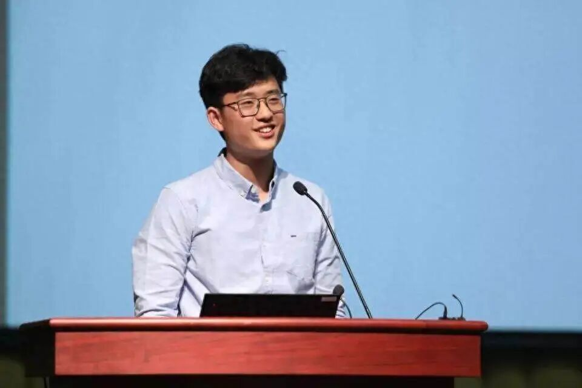
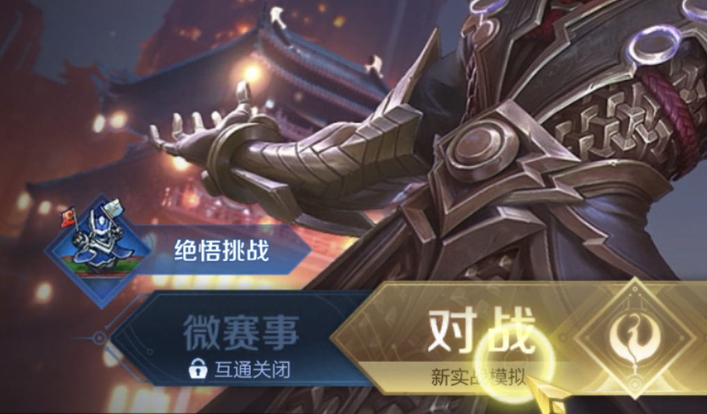
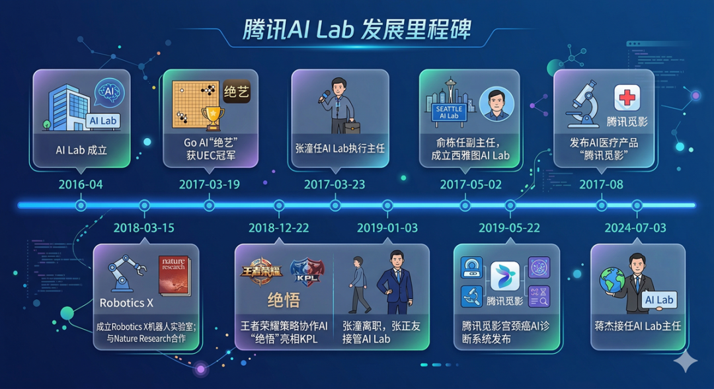

# 腾讯撤掉 AI Lab，不只是一次组织调整

今天 AI 圈里最值得写的一条，不是哪个模型又刷榜了。

而是腾讯把 **AI Lab 这块牌子撤了，部分人员并入混元**。

很多人看到这种消息，第一反应会是：大厂组织调整，很正常。

但如果你把这件事放到今天中国大模型竞争的节奏里看，它就没那么简单了。

这不是一次普通的人事变化。

更像是腾讯在明确表态：

**AI 这件事，接下来不再以“实验室逻辑”为中心，而要以“大模型主航道”和更直接的业务结果为中心。**

## 为什么这件事值得高看一眼

腾讯 AI Lab 不是一个轻飘飘的部门名。

它代表过腾讯在基础研究、算法能力、产学研合作和长期 AI 布局上的一个重要象征。

从计算机视觉、语音、NLP，到后来的医疗、生命科学、决策智能，这块牌子背后其实承载过腾讯很多年对“前沿 AI 能力”的押注。

所以今天真正值得关注的，不是“AI Lab 还在不在”。

而是：

**为什么这个时间点，腾讯选择把它拆开、并入、重排主次。**

答案其实不难猜。

因为今天中国大厂做 AI，已经越来越不适合继续按旧时代那种“研究归研究，产品归产品，业务归业务”的节奏往前推了。

现在大模型竞争太快了。

快到你如果还维持传统实验室结构，很多资源会显得不够集中，很多方向会显得不够统一，很多成果也来不及真正变成战斗力。

## 说白了，腾讯现在更想要的是“会师”，不是“并行”

原文里有个词其实很关键，就是“向混元会师”。

这个判断我觉得是对的。

过去大厂做 AI，往往会保留一种比较典型的配置：

- 一边是实验室，负责研究、论文、前沿探索、技术储备
- 一边是业务线，负责产品落地、模型训练、商业推进

这种模式在前一个 AI 阶段是成立的。

因为那时候技术演进速度虽然快，但还没快到所有资源都必须往一个点上砸。

可到了今天，尤其是大模型时代，情况完全不一样了。

你不只是要研究。

你还要训练。

还要工程化。

还要产品化。

还要抢时间窗口。

还要抢人才。

还要把组织内部各种力量压到同一个方向上。

这时候，继续把大量高价值研究资源散在不同组织形态里，成本就会越来越高。

所以腾讯这一步，本质上更像是在做一次资源会师。

不是 AI 不重要了。

恰恰相反。

是因为 AI 太重要了，所以不能再分散打。

## 这说明中国大厂的 AI 竞争，已经从“布局阶段”进入“主战阶段”了

我觉得这件事背后最值得写的，不只是腾讯本身。

而是它折射出来的一整个行业变化。

过去两年，国内大厂做 AI，很多时候还带一点“先把牌占住”的味道。

大家都在建团队、挖人、发模型、发平台、讲生态。

那时候重点是：

- 先上牌桌
- 别掉队
- 别让市场觉得你没戏

但今天，这个阶段已经过去了。

现在大家真正拼的，是主战能力。

也就是：

- 谁的核心资源更集中
- 谁的组织效率更高
- 谁的人才配置更能打
- 谁的模型迭代更快
- 谁的结果更能落在业务和市场上

所以腾讯撤 AI Lab 这事，如果你只把它看成“缩编”或者“收缩”，就容易看浅。

它更像是一个信号：

**大厂做 AI，开始越来越像打总决战，资源不能再散着用。**

## 人才流动也说明，这个阶段已经变了

这条消息里另一个值得注意的点，是它不是孤立事件。

放在一起看，还有两条线索很关键：

- 姚顺雨加入腾讯后，混元权重明显上升
- DeepSeek 也传出核心人才流动消息

这说明一件事：

**现在真正值钱的，不只是团队规模，而是最能决定路线和结果的核心人才。**

因为在这个阶段，很多事情不是人多就行。

而是要有人能拍板，有人能定路线，有人能把研究、训练、工程、产品这几件事真正拧成一股绳。

所以今天你看到的，不只是组织变化。

本质上也是资源重配、权力重配、人才重配。

谁能更快把关键人才和关键方向压到主战线上，谁就更有机会把大模型这场仗往前推。

## 这件事真正残酷的地方在于：以后“大厂实验室光环”会越来越不值钱

这一点我觉得挺现实。

以前 AI Lab 这种牌子，本身就很有象征意义。

它代表顶级科学家、代表长期投入、代表研究实力、代表技术想象力。

但在今天这个阶段，光环本身的价值正在下降。

市场越来越不买“你研究很强”这套单了。

市场更在意的是：

- 你能不能把模型做出来
- 你能不能把产品打出来
- 你能不能把业务跑起来
- 你能不能把组织效率拉上去

也就是说，今天 AI 组织的价值评判标准，已经越来越从“研究象征”转向“战斗结果”。

这很残酷，但也很真实。

所以腾讯这次动作，本质上也像是在承认这个现实：

**实验室逻辑，不再天然站在组织核心了。**

核心的位置，现在属于更能打结果的地方。

## 最后一句

腾讯撤掉 AI Lab 这件事，表面看是一场组织调整。

但本质上，它更像是中国大厂 AI 战争进入下一个阶段的一个缩影。

过去大家比的是有没有布局。

现在大家比的是，能不能把最强的人、最重的资源、最关键的方向，真正压到同一条主航道上。

实验室当然还重要。

研究当然也重要。

但在今天这个阶段，真正决定胜负的，已经不只是研究能力本身。

而是谁能把研究能力更快地转成模型能力、产品能力和组织战斗力。

这才是腾讯这次动作最值得高看一眼的地方。

而且说得再直一点，接下来国内大厂的 AI 竞争，可能会越来越少一点“讲故事”的空间，越来越多一点“交结果”的压力。

一旦进入这个阶段，所有组织、所有团队、所有头衔，最后都得回答同一个问题：

**你到底能不能打。**

以上，既然看到这里了，如果觉得不错，随手点个赞、在看、转发三连吧，如果想第一时间收到推送，也可以给我个星标⭐～谢谢你看我的文章，我们，下次再见。
