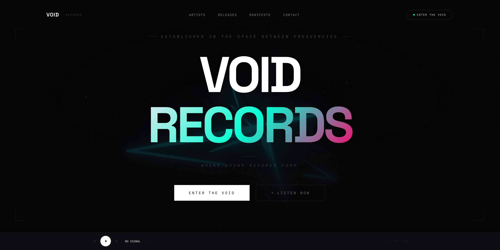
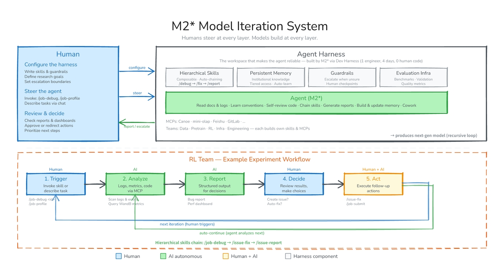

# MiniMax M2.7 刚刚发布：这次最值得看的，不是参数，而是模型开始“帮自己进化”

今天 MiniMax 发布了 **M2.7**。

如果只看表面，你会觉得这又是一轮常规迭代。

模型更强了。

编程更好了。

办公更稳了。

Agent 能力更完整了。

但这次真正值得写的，不只是“又变强了”。

而是 MiniMax 直接把一个更激进的方向摆上台面：

**模型开始深度参与迭代自己的模型。**

这句话，才是 M2.7 最关键的信号。

## 这次发布，核心不是普通升级

MiniMax 官方这次讲得很直白。

M2.7 是他们**第一个深度参与迭代自己的模型**。

它不只是会回答问题。

也不只是会写代码。

而是已经可以基于 Agent Harness、Agent Teams、复杂 Skills、Tool Search 这些能力，直接参与到研发和优化流程里。

换句话说，过去是人训练模型。

现在开始变成：

**模型也在帮人训练下一代模型。**

这和以前那种“模型辅助 coding”不是一回事。

这是把模型往更高一层抬了。

从工具，开始往“研发系统中的执行者”走。

## 它到底能做什么

按照官方披露，M2.7 已经不只是停留在 demo 层。

它已经能在真实研发流程里承担一部分具体工作。

比如：

- 讨论实验方案
- 协助文献调研
- 跟踪实验规格
- 完成数据流水线和对接工作
- 启动实验
- 自动监控实验状态
- 读日志、排查问题、分析指标
- 修代码、提合并请求、跑冒烟测试

这些事情如果拆开看，都不算新鲜。

但真正让人有感觉的是，MiniMax 说它已经能在某些研发场景里承担 **30% 到 50%** 的工作流。

这就不是“帮你补一点边角料”了。

而是真的开始进流程、吃流程、改流程。

## 这次最炸的点，是“模型开始帮自己训练自己”

我觉得 M2.7 最值得写的，不是某个 benchmark 数字。

而是这套自我进化逻辑。

官方给的案例里，有一个细节很关键：

他们让 M2.7 去优化内部脚手架上的软件工程表现。

这个过程中，M2.7 自主执行了这样的循环：

- 分析失败轨迹
- 规划改动
- 修改脚手架代码
- 跑评测
- 对比结果
- 决定保留还是回退

而且这个迭代循环，**连续跑了 100 多轮**。

这意味着什么？

意味着模型已经不是在一次性回答。

而是在一个闭环里持续试错、持续修正、持续优化。

这件事一旦成立，AI 的意义就会开始变。

因为模型不再只是“提供答案”。

而是开始“参与改进产生答案的系统”。

## 编程能力，MiniMax 这次也确实打得更深了

当然，M2.7 这次也不是只讲概念。

在工程能力上，MiniMax 也把很多话说得很重。

比如官方重点强调：

- 真实软件工程
- 线上故障调试
- 日志分析与 Bug 定位
- 代码安全
- 机器学习
- 安卓开发
- 端到端完整项目交付

这里面我最在意的，不是“会写代码”。

而是它开始强调：

**理解生产系统、分析真实问题、缩短故障恢复时间。**

这就说明它想抢的不只是 coding assistant 这层定位。

它想要的是更像工程搭子，甚至更像研发流程里的半个同事。

如果这个方向走通，那模型的价值就不只是产出速度。

而是会开始直接影响研发组织效率。

## 办公能力也不是顺手一提

这次官方还明显强化了另一个点：

**Office 三件套能力。**

也就是 Word、Excel、PPT 的复杂编辑、多轮修改和高保真处理。

这点其实很多人会低估。

因为现在大模型圈最容易被讨论的，永远是代码。

但对真实公司来说，办公流才是真正高频场景。

谁能稳定处理文档、表格、汇报材料，谁才更容易进日常工作流。

MiniMax 这次把这一块和 Agent 能力绑在一起讲，意思已经很明显了：

**他们想做的不是单点爆款能力，而是更完整的生产力底座。**

## 这件事为什么重要

因为 M2.7 抛出来的，其实不是“我们又把模型调强了一点”。

而是一个更大的行业方向：

**未来的大模型竞争，可能不只是卷谁更会答题，而是卷谁更像一个会自我优化的 Agent 系统。**

这和前一阶段非常不一样。

前一阶段大家更像在比：

- 谁基准分更高
- 谁上下文更长
- 谁推理更快
- 谁便宜

但现在越来越明显，下一阶段真正会拉开差距的，是：

- 谁能稳定进工作流
- 谁能处理复杂环境
- 谁能跟工具链长期协作
- 谁能自己帮助自己迭代

MiniMax 这次把“模型自我进化”摆到台前，其实就是在抢这条叙事线。

## 我的看法

我觉得 M2.7 这次最值得看的，不是它有没有哪项分数超过谁。

而是它把一个更真实的问题提前说破了：

**AI 的下一步，不只是更聪明，而是更能自己推进复杂系统。**

如果模型只能回答，那它还是工具。

如果模型能进入流程、优化流程、甚至帮助迭代下一代模型，那它在组织里的位置就会开始变化。

这也是为什么我觉得 MiniMax 这次发布，真正有价值的地方，不在“新模型上线”这五个字。

而在于它给出了一个非常清楚的方向：

**模型不只是生产力工具，它正在尝试变成生产力系统的一部分。**

## 最后

所以如果把 MiniMax M2.7 这次发布压成一句话，我的结论是：

**这次最值得看的，不是模型又变强了，而是模型开始被推进到“参与改进自己”的位置上。**

这一步如果跑通，后面的竞争就不会只是谁更像一个聪明助手。

而是谁更像一个能持续进化、持续交付、持续嵌入真实组织流程的 Agent 系统。

这才是 M2.7 这次真正让人警觉，也真正值得写的地方。

**以上，既然看到这里了，如果觉得不错，随手点个赞、在看、转发三连吧，如果想第一时间收到推送，也可以给我个星标⭐～谢谢你看我的文章，我们，下次再见。**
