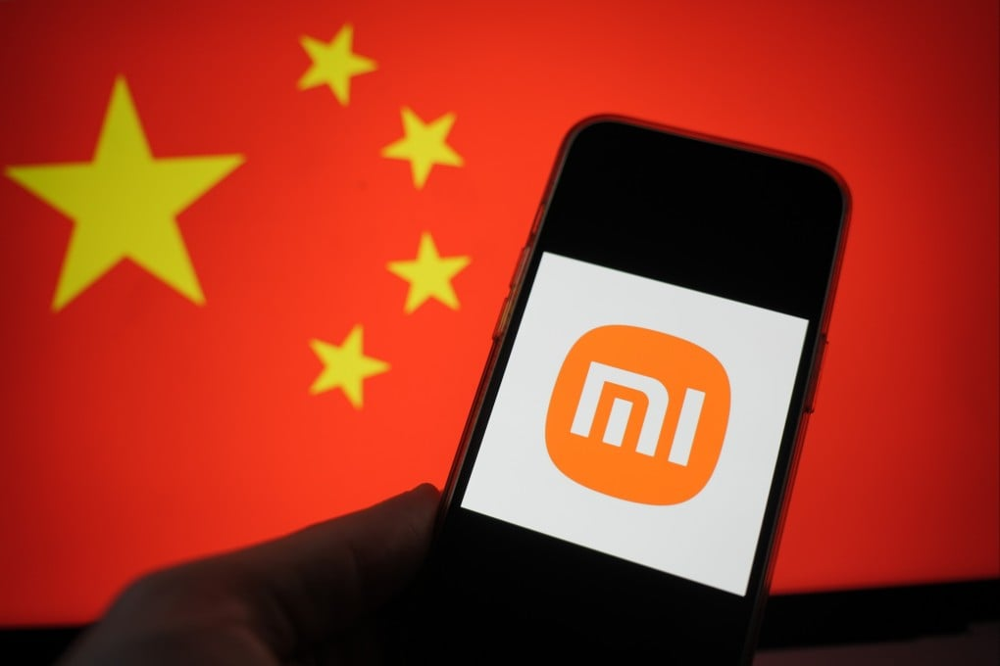
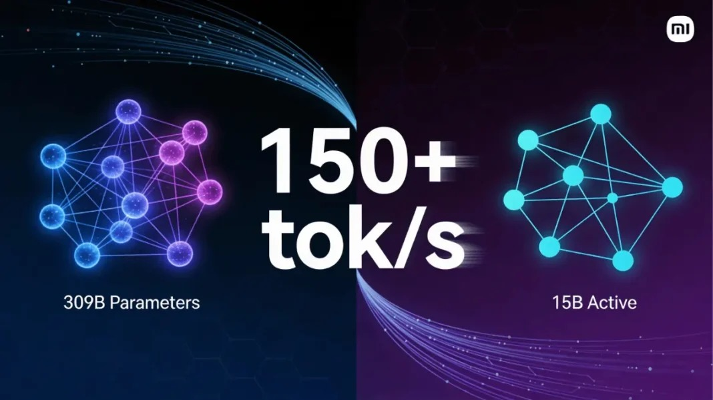
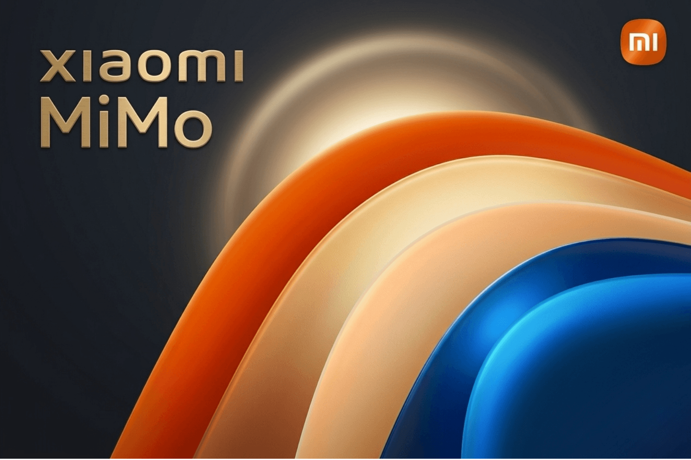

# 小米 Mimo 上桌了：OpenRouter 神秘模型揭晓，真正值得看的是这个信号

前几天，OpenRouter 上线了一批神秘模型。

没有公开名字。

只有代号。

但调用量一路往上冲，讨论度也越来越高。

很多人都在猜：

这到底是谁家的新模型？

结果现在答案出来了。

背后站着的，不是 OpenAI，不是 Anthropic，也不是很多人最先猜的 DeepSeek。

而是 **小米 Mimo**。

## 这件事为什么值得写

因为这不是一次普通的“新模型官宣”。

真正有意思的地方在于：

**它先以匿名代号在 OpenRouter 上试水，跑出真实调用量和讨论度，最后才公开身份。**

这套动作，已经不是传统的“先开发布会，再等大家试用”。

而更像是一种更接近产品验证的玩法。

先丢进真实调用环境。

先让开发者用。

先看口碑、成本、稳定性和替换意愿。

最后再揭牌。

这个顺序本身，就很说明问题。

## 为什么很多人会盯上它

因为它在匿名阶段就已经不是一个普通的新模型了。

从公开信息看，小米这次推出来的是 **MiMo-V2-Pro** 这条线。

它不是只强调聊天效果，也不是只卷一个 benchmark 分数。

官方给的方向非常明确：

- 面向 Agent 场景
- 强调真实工作流
- 更偏 coding 和复杂任务执行
- 支持 1M 上下文
- 想做“系统的大脑”，而不是单次问答机器

这就意味着，它想抢的不是通用聊天入口那张桌子。

而是更有价值的那张桌子：

**Agent 底座模型。**

## 这次最值得看的，不是“小米也做模型”

说实话，今天再写“小米也做大模型”，已经没什么意思了。

真正值得看的，是小米想把 Mimo 放到什么位置上。

从这次披露的信息看，MiMo-V2-Pro 的野心不是做一个“会答题的模型”。

而是想做一个：

- 可以接工作流
- 可以进 Agent 框架
- 可以跑长流程复杂任务
- 可以扛长上下文
- 可以在真实系统里持续交付结果

这和很多停留在“会不会说、会不会写”的模型，不是一个打法。

它要争的是更深的位置。

## OpenRouter 为什么把这件事放大了

因为 OpenRouter 不是一个 PPT 舞台。

它是一个真实分发和真实调用入口。

模型一旦挂上去，面对的不是宣传稿。

而是：

- 真请求
- 真成本
- 真替换关系
- 真开发者反馈
- 真口碑积累

所以这次“神秘模型揭晓是小米 Mimo”真正重要的，不是揭秘这件事本身。

而是它等于告诉市场：

**小米这次不是来刷存在感的，而是真想进开发者工作流。**

## 这背后的信号更值得看

过去很多厂商做模型，优先抢的是：

- 通用聊天
- 演示效果
- 跑分
- 认知度

但现在越来越清楚，下一轮更值钱的位置开始往这边走：

- API 调用入口
- Agent 场景适配
- 成本效率比
- 长上下文可用性
- 工具调用稳定性

也就是说，模型越来越不像一个“秀智商的产品”。

而更像一个要被接进真实系统里的零件。

谁能在这种环境里站稳，谁才更可能真正吃到下一轮红利。

从这个角度看，小米 Mimo 这次公开，真正重要的不是身份揭晓。

而是它正式开始抢位了。

## 我的判断

我觉得这件事最值得看的，不是“原来神秘模型是小米”。

而是：

**小米已经不满足于做一个有存在感的模型，而是在试图把 Mimo 推到 Agent 时代的基础设施位置上。**

如果只是普通模型发布，这事热两天就过去了。

但如果它真能在 OpenRouter 这种真实调用环境里稳住，那意义就不一样了。

因为那说明它争的不是热搜位。

而是替换位。

是开发者会不会真的把它接进自己的工作流里。

## 最后

所以这件事真正值得写的地方，不是“小米模型公开了”。

而是：

**一个先在真实调用场景里跑出讨论度，再公开身份的模型，背后反映的是大模型竞争开始更像产品竞争，而不是单纯的发布竞争。**

谁能先进真实工作流。

谁能在开发者手里活下来。

谁能在 Agent 场景里被持续调用。

谁才更接近下一阶段真正有分量的位置。

从这个角度看，小米 Mimo 这次上桌，值得看的不是悬念揭晓。

而是它正式开始抢位了。

**以上，既然看到这里了，如果觉得不错，随手点个赞、在看、转发三连吧，如果想第一时间收到推送，也可以给我个星标⭐～谢谢你看我的文章，我们，下次再见。**
