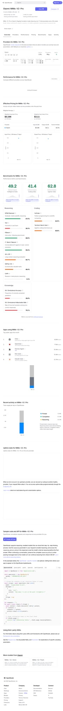

# 小米 Mimo 上桌了：OpenRouter 神秘模型揭晓，真正值得看的是这个信号

前几天，OpenRouter 上线了一批神秘模型。

没有公开名字。

只有代号。

但调用量一路往上冲，讨论度也越来越高。

很多人都在猜：

这到底是谁家的新模型？

结果现在答案出来了。

背后站着的，不是 OpenAI，不是 Anthropic，也不是大家最先猜的 DeepSeek。

而是 **小米 Mimo**。

## 这件事为什么有意思

因为这不是一次普通的“新模型上线”。

真正有意思的点在于：

**一个先以匿名代号在 OpenRouter 上试水的模型，最后被确认是小米的新一代 Mimo。**

这说明什么？

说明现在模型竞争已经不只是“发布会谁先开”。

而开始变成：

- 先在真实调用环境里跑
- 先在开发者社区里试
- 先看实际口碑和调用量
- 再揭身份

这套玩法，本质上更像产品市场验证。

不是先吹，再等大家试。

而是先丢到一线使用场景里，看看它到底能不能打。

## 为什么很多人会盯上这个模型

因为它在 OpenRouter 上挂着匿名代号时，就已经引起不少人讨论了。

最核心的原因不是神秘感本身。

而是：

**它在真实使用里的表现，确实不像一款普通的新模型。**

从目前公开信息看，小米这次推出来的是 **MiMo-V2-Pro** 这条线。

官方给的方向很明确：

- 面向 Agent 场景
- 更偏真实工作流
- 强调 coding 与复杂任务执行
- 1M 上下文
- 往“系统大脑”那个方向去打

这就意味着它想争的，不是聊天模型那一桌。

而是更像要去抢：

**Agent 底座模型** 这张牌桌。

## 真正值得看的，不是“小米也做模型”

说实话，今天再写“小米也做大模型”，已经没有什么意思了。

这事早就不是新闻。

真正值得看的，是小米这次想用 Mimo 去占的位置。

从公开信息来看，MiMo-V2-Pro 的叙事非常明确：

它不是只想做一个“能答题的模型”。

而是想做：

- 可以接工作流
- 可以进 Agent 框架
- 可以跑复杂任务
- 可以扛长上下文
- 可以在真实环境中稳定交付结果

这就和很多还停留在“会不会说、会不会写”的模型，不是一个打法了。

## OpenRouter 这个入口，反而把事情放大了

OpenRouter 最大的意义，是它不是一个封闭秀场。

它是一个真实的开发者调用入口。

模型一旦挂上去，面对的就不是 PPT。

而是：

- 真请求
- 真对比
- 真成本
- 真口碑
- 真替换关系

所以这次“神秘模型公开是小米 Mimo”这件事，真正让人有感觉的，不是揭秘本身。

而是它等于告诉市场：

**小米这次不是只来刷存在感，而是真的想进开发者和 Agent 这条主战场。**

## 这背后是个更大的信号

我觉得真正值得写的，是这件事背后的行业变化。

过去很多厂商做模型，优先抢的是：

- 通用聊天
- 跑分
- 演示效果
- 大众认知

但现在越来越清楚，下一轮更有价值的位置，开始往这边走：

- API 调用入口
- Agent 场景适配
- 成本效率比
- 长上下文可用性
- 工具调用稳定性

也就是说，模型不再只是一个“展示智力”的东西。

它越来越像一个要被接进真实系统里的零件。

谁能在这种环境里站稳，谁才更可能真正吃到下一轮红利。

小米 Mimo 这次公开，其实就是在给外界一个信号：

**它想要的不是围观流量，而是真正进系统。**

## 我怎么判断这件事

我的看法很简单。

这次最值得看的，不是“原来神秘模型是小米”。

而是：

**小米已经不满足于做一个有存在感的模型，而是在试图把 Mimo 推到 Agent 时代的基础设施位置上。**

如果只是普通模型发布，这事热两天就过了。

但如果它真的能在 OpenRouter 这种真实分发和调用环境里稳住，后面意义就不一样了。

因为那说明它争的不是热搜位。

而是替换位。

是开发者会不会真的把它接进自己工作流里。

## 最后

所以这件事真正值得写的地方，不是“小米模型公开了”。

而是：

**一个先在真实调用场景里跑出讨论度，再公开身份的模型，背后反映的是大模型竞争开始更像产品竞争，而不是单纯的发布竞争。**

谁能先进真实工作流。

谁能在开发者手里活下来。

谁能在 Agent 场景里被持续调用。

谁才更接近下一阶段真正有分量的位置。

从这个角度看，小米 Mimo 这次上桌，值得看的不是悬念揭晓。

而是它正式开始抢位了。

**以上，既然看到这里了，如果觉得不错，随手点个赞、在看、转发三连吧，如果想第一时间收到推送，也可以给我个星标⭐～谢谢你看我的文章，我们，下次再见。**
