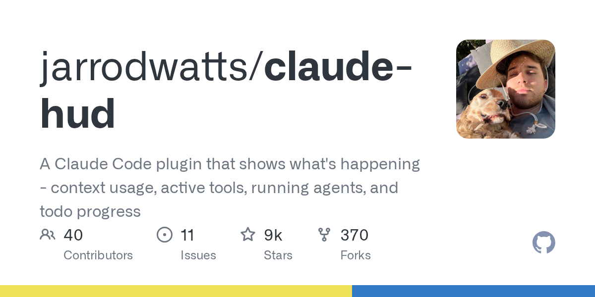
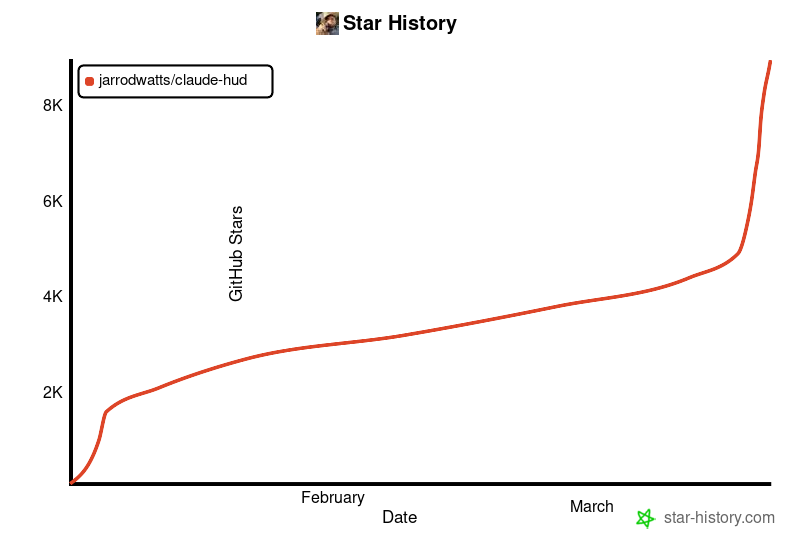

# AI 编程下一步，不只是能干活，而是你得看见它在干嘛

这两天，GitHub 上一个叫 **claude-hud** 的项目热度冲得很快。

表面看，它只是一个给 Claude Code 用的插件。

但如果你再多看一眼就会发现，这东西真正打中的，不是“又多了一个 AI 工具”，而是一个越来越真实的新问题：

**当 AI 开始替你读文件、改代码、调工具、跑子任务时，人类越来越需要的，已经不是再多一个 agent，而是一个能看清 agent 在干嘛的窗口。**

这就是 claude-hud 爆起来的原因。

它不是在解决“AI 会不会写代码”。

它在解决另一个更靠后的问题：

**AI 越能干，人越容易失去过程感。**

## 以前大家追求的是“能不能自动做”

前一阶段，AI 编程产品最卷的地方很明确。

谁能补全得更快，谁能跨文件修改，谁能读懂整个项目，谁能自己调用工具，谁就更容易被市场记住。

所以过去一段时间，大家几乎都在追同一件事：

**让 AI 更像一个能直接干活的人。**

这条路当然没错。

因为如果 AI 连干活都干不好，后面一切都是空话。

但问题是，一旦它真的开始能干活了，新的焦虑也会一起冒出来。

你会开始想知道：

- 它刚刚读了哪些文件？
- 它现在在调什么工具？
- 它到底有没有卡住？
- 它是不是又开了子任务？
- 它现在的上下文还剩多少？
- 它离把上下文打爆还有多远？

说白了，能力一旦上来了，**可见性** 就会立刻变成刚需。

## claude-hud 为什么能火

claude-hud 做的事情其实不复杂。

它把原本藏在 AI 编程过程里的几个关键信号，直接放到了你输入框下面：

- 项目路径
- context 使用情况
- 工具活动
- 子 agent 状态
- todo 进度
- usage 限额消耗

你可以把它理解成一个“AI 干活状态栏”。

这东西乍看很小，但意义其实很大。

因为它解决的不是模型能力问题，而是**人与 agent 之间的信任接口问题**。

过去很多 AI 编程产品给人的感觉，像一个黑箱。

你发一句话，它开始自己跑。

你知道它很强，但你并不总知道它到底在怎么强。

而一旦看不清，人就会陷入两种极端：

**一种是过度信任。**
觉得它既然会跑，就让它自己跑到底。

**另一种是过度怀疑。**
因为看不清过程，所以每一步都想打断、确认、复查。

这两种状态都不舒服。

claude-hud 之所以戳中很多人，就是因为它在中间补了一层：

**不替你做决定，但让你看见过程。**

## AI 编程正在从“黑盒爽感”走向“过程透明”

这是我觉得这件事最值得写的地方。

以前很多 AI 产品最爱卖的一种感觉，叫“爽”。

一句话下去，它哗啦啦给你干一堆活。

这种体验在最开始当然很震撼。

但你只要真的拿它做过几次复杂任务，就会很快发现：

**爽归爽，黑盒也是真的黑。**

尤其是做代码这种事情，和普通问答不一样。

代码不是回答完就结束了。

它有文件依赖，有上下文限制，有工具调用，有版本状态，有分支差异，还有一大堆“改完之后别把别的地方顺手搞炸”的隐形风险。

所以 AI 编程一旦从 demo 进入真实工作流，它就迟早要面对一个问题：

**用户不只要结果，也要过程可感知。**

claude-hud 其实就是这种需求的一个很典型的表现。

它提醒了所有人一件事：

下一阶段的 AI 编程，不是谁更像魔法，而是谁更敢把魔法拆开给你看。

## 真正值钱的，不只是 agent，而是“agent 的监工系统”

很多人现在还在追“更强 agent”。

但我越来越觉得，未来真正值钱的东西，可能不只是 agent 本身。

而是围绕 agent 长出来的一整套配套层：

- 监控
- 可视化
- 审计
- 回放
- 风险提示
- 进度反馈
- 权限边界
- 失败恢复

为什么？

因为 agent 一旦开始承担更长链路、更高价值的任务，它就不再只是一个“生成器”。

它会更像一个执行系统。

而所有执行系统，最后都绕不开同一个问题：

**谁来盯着它？**

人类公司里，一个新人进来干活，你不会一句交代完就完全不看。

你会看进度，看方法，看偏没偏，看有没有卡住。

AI 也是一样。

只是以前大家太着急证明“它能干活”，所以把“怎么盯它干活”这件事放到了后面。

现在像 claude-hud 这种项目起来，说明市场已经开始补这一课了。

## 这件事背后，其实是一个更大的趋势

如果你把 claude-hud 放到更大的背景里看，它其实不是一个孤立项目。

它背后对应的是一个很清楚的趋势：

**AI 编程正在从“能力竞赛”进入“协作竞赛”。**

能力竞赛比的是：
- 谁更强
- 谁更快
- 谁改得更多
- 谁能自动跑更长的流程

协作竞赛比的是：
- 谁更可控
- 谁更透明
- 谁更容易插手
- 谁更适合和人长期一起工作

这两者看起来差不多，实际上完全不是一回事。

一个产品可以很强，但不一定适合长期协作。

它可能很猛，但你不放心。

它可能很快，但你看不懂。

它可能什么都能做，但你不知道它下一秒会不会跑偏。

而真正能留下来的产品，往往不是“最像魔法”的那个。

而是**最能让人安心把工作交给它一部分的那个。**

这也是为什么我会觉得 claude-hud 这个题，不是小题。

它看起来只是一个状态栏插件。

但本质上，它是在回答 AI 编程落地里一个非常核心的问题：

**当 agent 越来越像员工时，人类到底怎么重新获得掌控感？**

## 最后一句

claude-hud 爆火，表面看是开发者又在追一个新插件。

但更深一点看，它其实暴露了 AI 编程正在进入下一阶段。

以前大家最关心的是：AI 能不能替我干活。

现在越来越多人开始关心的是：

**它干活的时候，我能不能看见、看懂、看得放心。**

这不是小修小补。

这是 AI 编程从“惊艳演示”往“长期协作”迈的一步。

真正成熟的工具，不会只告诉你它有多强。

它还会让你知道，它现在到底在干什么。

但这件事真正让我有感觉的，不是一个插件本身多炫。

而是开发者群体终于开始把注意力，从“AI 会不会替我做”转向“AI 做的时候我怎么跟它共处”。

这说明大家已经不是把 AI 编程当玩具了，而是在认真把它当工作系统的一部分。

一个东西只有真正开始进入生产环境，人们才会重新追问透明度、可控性和安全感。

所以 claude-hud 这种项目的火，不是偶然。

它不是在证明 AI 更强了。

它是在提醒所有人：

**AI 越强，人类越需要重新拿回过程里的存在感。**

这可能才是下一阶段最重要的变化。

以上，既然看到这里了，如果觉得不错，随手点个赞、在看、转发三连吧，如果想第一时间收到推送，也可以给我个星标⭐～谢谢你看我的文章，我们，下次再见。
