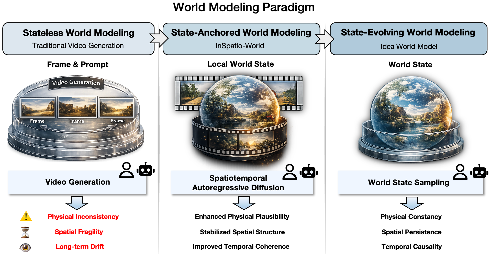
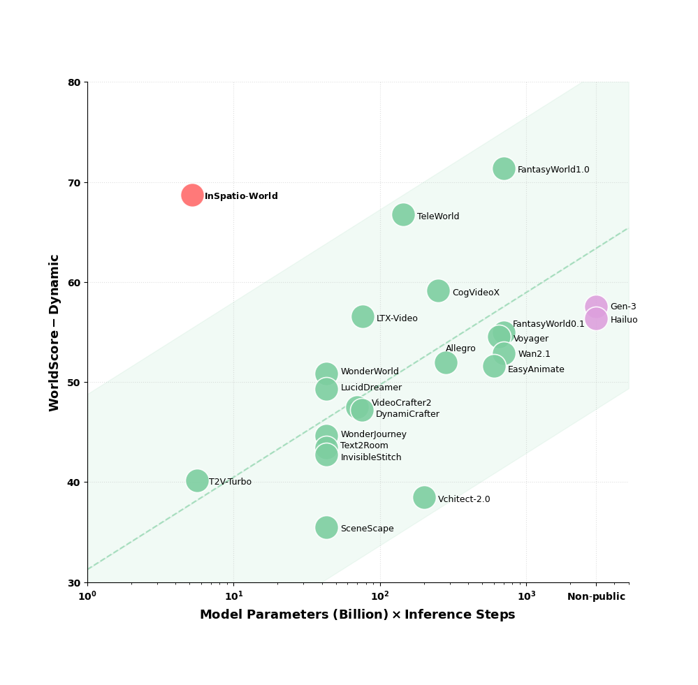
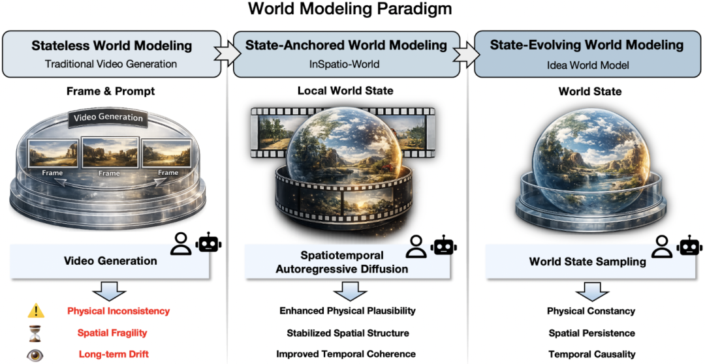

# 世界模型这场仗，开始不只属于大厂了

这两天，世界模型赛道又被推上来了。

但这次真正值得看的，不只是“又出了一个新模型”，而是一个更重要的信号：

**这条原本看起来只属于大厂、顶级实验室和超级融资玩家的赛道，开始出现更有现实感的新变量了。**

这次被讨论得很多的，是浙大背景创业团队影溯（InSpatio）放出来的 **InSpatio-World**。

它最容易吸引眼球的标签当然很多：开源、实时、4D 世界、榜单第一、百卡训练。

但如果只盯这些标签，其实很容易看浅。

真正值得高看一眼的，不是它又多炫，而是它开始让人看到一种可能：

**世界模型这件事，未必只能靠无限堆钱、堆卡、堆参数去推进。**

## 世界模型为什么重要

过去几年，AI 最热的主线其实一直都很清楚。

先是大语言模型把“理解和生成文字”推起来，再是图像和视频模型把“生成内容”这件事推得越来越像样。

但走到今天，行业越来越清楚一件事：

**光会生成，还不够。**

如果 AI 以后真的要走进现实世界，去服务机器人、自动驾驶、AR/VR、空间内容、工业仿真这些场景，那它不能永远只停留在“把下一帧生成得更像”这个层面。

它得理解空间。

它得知道物体在什么位置，状态怎么变化，时间怎么推进，视角切换之后世界是不是还自洽。

说得直白一点，世界模型想解决的不是“再画得真一点”，而是：

**让 AI 开始更像是在建模世界，而不是只在补像素。**

这也是为什么，这条线被很多人看成是下一轮 AI 的深水区。

## 过去这条赛道的问题，是太容易变成“资源战争”

世界模型听起来很性感，但一直有个很现实的问题：

太贵。

因为它吃的不是单一能力，而是一整套复杂要求：

- 要有强视觉理解
- 要有空间结构能力
- 要有时间连续性
- 要有物理一致性
- 要能处理交互和状态变化
- 最后还得跑得动

所以这条线特别容易往一个熟悉方向滑：

**谁资源多，谁就更容易讲领先故事。**

这也是为什么，以前一提世界模型，很多人的第一反应就是：

这东西离普通团队太远了。

离一般企业更远。

它更像一个资本、算力和顶级研究能力一起叠加的游戏。

而这次 InSpatio-World 最有意思的地方，恰恰在于它试图证明另一件事：

**架构路线本身，也可能决定胜负。**

## 它最值得写的，不是“会生成 4D 世界”，而是它更强调从三维空间去理解世界

这个点很关键。

现在很多模型看起来很强，本质上还是在二维像素层面做统计逼近。

这种方式当然有效，因为视频数据够多、训练路径也更顺。

但问题是，一旦你真的想让 AI 理解物理世界，而不是只生成看起来像真的画面，二维路径就会越来越吃力。

因为世界本来就不是二维的。

空间关系不是二维的。

物体的存在也不是二维的。

时间推动下的状态变化，更不是简单的“下一帧长什么样”。

所以 InSpatio-World 这次更值得盯的，是它明显更强调：

**别再只围着像素转了，要从空间结构本身下手。**

这背后的判断其实很硬核：

如果 AI 最终要进入现实，那它内部对世界的理解，也迟早要更接近现实本身的组织方式。

## 真正值钱的，不是“做出一个更酷 demo”，而是把世界模型往可用性推了一步

我觉得很多人容易把这种新闻看成“又一个厉害 demo”。

但如果只是 demo，其实意义没那么大。

真正值得写的，是它有几个地方开始显出“往可用推进”的味道了。

### 第一，实时性开始被认真对待

世界模型如果永远只能离线慢慢算，那它当然也有研究价值。

但它的产业价值会被卡死。

因为你不管做机器人、自动驾驶、空间交互，还是训练虚拟环境，最后都绕不过一个问题：

**能不能足够快。**

一旦速度上不来，再厉害也只是实验室里的漂亮结果。

### 第二，成本和算力门槛开始变得能讨论

这一点特别重要。

因为只有当一项技术不再只属于最有钱的玩家，它才可能真正扩散。

否则它再先进，也只是少数人的玩具。

### 第三，它把“从视频到可交互空间”这条链路往前推了一步

这件事如果真的持续往前跑，后面受影响的就不只是 AI 研究本身，而是一整批行业应用：

- 自动驾驶仿真训练
- 机器人策略模拟
- AR/VR 空间内容生产
- 游戏场景构建
- 数字孪生
- 影视与交互内容制作

所以这类模型真正的想象力，不在于“更好看”，而在于“更能用”。

## 这次最该高看的，不是情绪，而是路线意义

这种题最容易写成国产热血稿。

什么“杀回牌桌”“打出王炸”“吊打国外”。

这种写法不是不能看，但我觉得写浅了。

因为真正重要的，不是情绪先冲上来，而是你得看懂它到底说明了什么。

我更在意的其实是这件事背后的路线信号：

**世界模型这条线，开始出现不完全依赖超级资源堆叠的突破方式了。**

这很重要。

因为一条技术路线只有在开始出现更多解法、更多参与者、更多可扩散路径的时候，才说明它正在从“少数人的豪赌”进入“更大范围的竞争”。

而一旦进入这个阶段，行业节奏就会变。

大厂不再是唯一讲故事的人。

创业团队、学术团队、工程化更强的小团队，都开始有机会往前拱。

这才是最值得盯的地方。

## 它也提醒了一个更现实的问题：下一轮 AI 的门槛，可能不再只是语言和内容生成

过去几年，很多人对 AI 的理解还停留在：

- 会写
- 会画
- 会总结
- 会生成视频

但世界模型这条线一旦继续成熟，AI 的能力边界就会发生变化。

它会慢慢从“生成内容”走向“模拟环境”。

从“给你一个结果”，走向“推演一个过程”。

从“看起来像懂了”，走向“开始在更高维度上建模这个世界”。

这时候，AI 的角色就不再只是一个生成器。

它会越来越像一个预测器、仿真器、规划器。

而这件事一旦走通，很多行业的底层逻辑都会被改写。

## 最后一句

世界模型真正值得期待的地方，从来都不是它又让 AI 多会画一个更像真的视频。

而是它可能第一次让 AI 不再只是“看起来理解世界”，而是开始更接近真实规则地建模世界。

如果说过去几年的 AI 主线是“生成内容”，
那未来几年更深的一条主线，很可能会慢慢变成：

**生成世界。**

而这次最值得看的，不只是又有哪家大厂砸了多少钱。

而是有没有更多团队，能用更聪明、更高效、更可落地的方式，把这件事从昂贵实验室一步步推向真实产业。

但真正让我觉得这件事值得继续盯下去的，也不是一句“国产逆袭”能概括完的。

而是你会发现，AI 这轮竞争正在悄悄换挡。

以前卷的是谁更会生成。

接下来卷的，可能是谁更接近真实世界本身。

而一旦竞争打到这里，价值就不再只体现在 demo 的惊艳程度上，而会慢慢体现在谁更能支撑机器人、自动驾驶、AR/VR、数字空间这些真正重产业、重系统、重长期能力的方向。

这才是世界模型最可怕、也最值得期待的地方。

以上，既然看到这里了，如果觉得不错，随手点个赞、在看、转发三连吧，如果想第一时间收到推送，也可以给我个星标⭐～谢谢你看我的文章，我们，下次再见。
