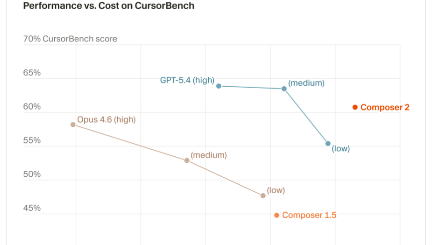
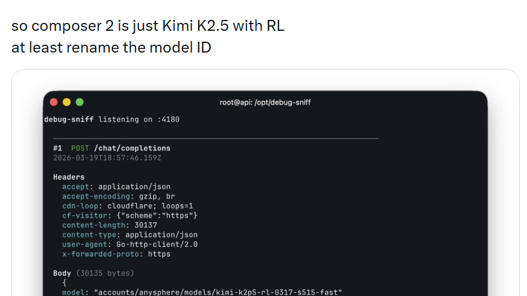
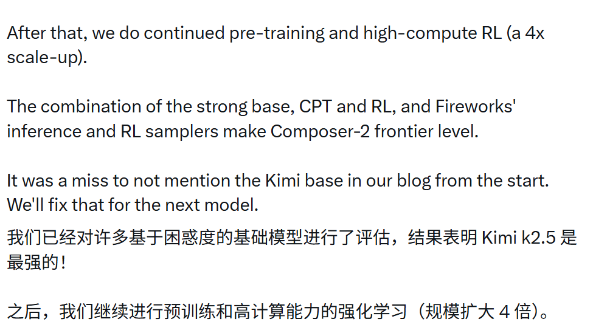
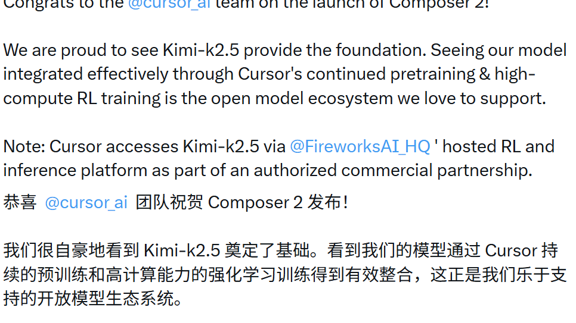
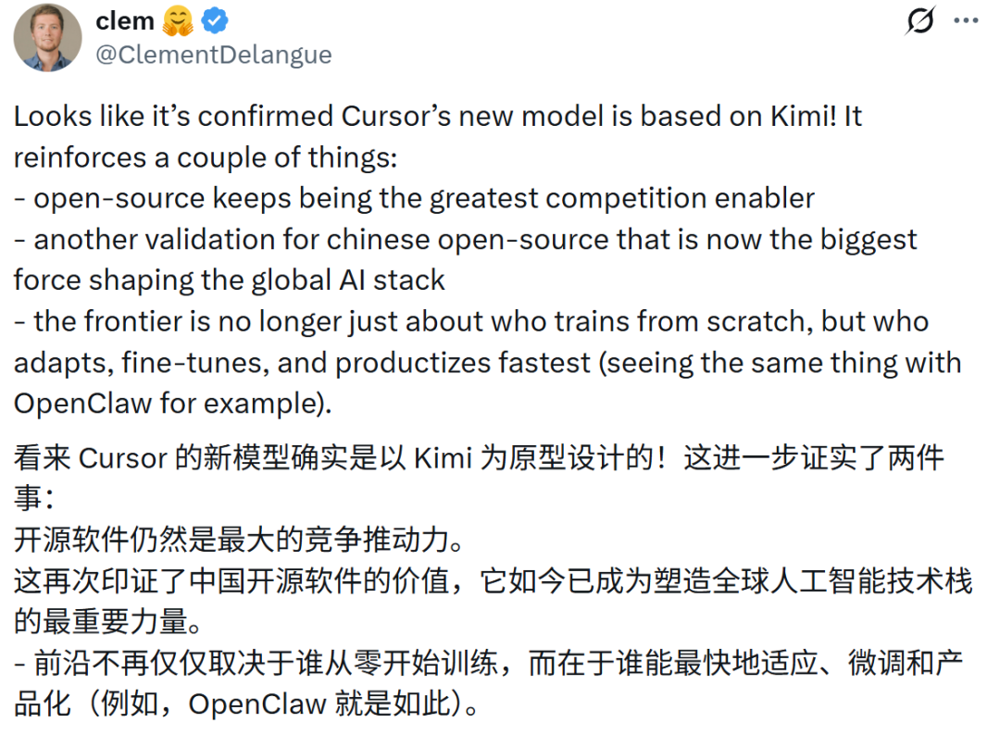

# Cursor 这次翻车，不只是因为它套了 Kimi

昨天 AI 圈最热的一出戏，不是某个模型又刷了榜。

而是 Cursor 刚把自家新模型 Composer 2 推出来没多久，就被人顺手扒出底层模型 ID 指向了 **Kimi K2.5**。

随后，围绕“是不是套壳”“有没有隐瞒”“该不该提前说清楚”这几个问题，社区直接炸锅。

如果只把这件事看成一次八卦，那就太浅了。

它真正值得写的，不是 Cursor 有没有用 Kimi 做底座。

而是它把 AI 行业一个越来越敏感的问题，彻底摆到了台面上：

**当开源底座越来越强，下游产品到底该怎么处理商业包装、技术透明度和底层致谢之间的关系？**

## 真正引爆争议的，不是“用了 Kimi”，而是“没先说”

这点要分清。

因为如果只是基于开源模型做持续预训练、强化学习、微调，这本身在 AI 圈根本不算什么稀奇事。

说白了，这甚至已经是默认操作了。

今天很多公司都不会从头开始训一切。

先找一个足够强的底座，再在上面做适配、强化、调优、产品化，这很正常。

所以 Cursor 真正被追着打的，不是“为什么用了 Kimi”。

而是：

**你明明用了，却在最开始对外讲的时候几乎没提。**

这就让整件事的味道变了。

因为一旦底座信息被刻意淡化，社区就会自然怀疑：

- 你是不是故意模糊贡献来源？
- 你是不是想把底座能力包装成自己的原创突破？
- 你是不是在吃开源红利的时候，又不愿意公开承认？

这才是争议真正炸开的地方。

## Cursor 这次踩中的，其实是开源时代最敏感的一根线

过去几年，AI 行业一直在吃开源的红利。

底座模型变强、推理成本下降、训练配方扩散、工具链越来越成熟，这些都让下游创业公司跑得更快。

但问题在于，越是这样，行业越需要一条基本的默契：

**你可以在开源底座上继续做产品，但你不能一边吃红利，一边把来源藏起来。**

这是开源生态里最脆弱也最重要的一层信任。

因为开源真正值钱的，不只是代码免费。

而是它提供了一种共同加速的方式。

有人负责打底座，有人负责优化，有人负责产品化，有人负责场景落地。

但这一切能转起来，有个前提：

**每一层都承认前一层的存在。**

一旦这层默契被打破，开源生态就会开始不舒服。

不是因为大家接受不了商业化。

而是接受不了“先模糊、被抓包、再补说明”这种路数。

## 这次事件真正说明的，是中国开源模型已经进了全球主战场

其实这件事里还有一层更重要的信号。

就是 Kimi 这次不是作为“陪跑角色”出现的。

它不是一个被顺手提到的备选模型。

而是 Cursor 团队自己承认，在评估过一堆基础模型之后，Kimi K2.5 是他们认为最强的底座之一，才会继续在上面做持续预训练和强化学习。

这意味着什么？

意味着中国开源模型现在已经不是“国内自己热闹一下”了。

它已经开始真正进入全球 AI 产品公司的底层技术栈。

这很关键。

因为过去一提全球 AI 栈，很多人默认想到的还是 OpenAI、Anthropic、Google、Meta 这些公司。

但这次 Cursor 这个事件，相当于从另一个角度证明了一件事：

**中国的开源模型，已经开始在国际产品层里扮演真正的底座角色。**

这件事本身，比“套壳”两个字更值得写。

## 以后行业真正会越来越在意的，不是你有没有做后训练，而是你有没有讲清楚

这件事后面大概率不会只发生一次。

而且以后只会越来越多。

因为接下来 AI 行业会越来越像这样：

- 底座模型越来越开放
- 下游产品越来越多
- 各种微调、蒸馏、持续预训练越来越常见
- 模型之间的“血缘关系”也会越来越复杂

在这种情况下，用户和开发者最后最在意的，不一定是你有没有基于别人的底座继续做。

而是：

**你有没有一开始就讲清楚。**

因为一旦讲清楚，大家会把重点放在：

- 你的后训练到底做得多强
- 你做了哪些强化学习和持续预训练
- 你的产品层到底带来了哪些新增价值

但如果不讲清楚，讨论焦点就会瞬间从技术价值变成诚信问题。

而一旦讨论切到诚信，品牌损耗会比技术争议大得多。

## 这事还顺手暴露了一个现实：应用层护城河没大家想得那么稳

我觉得这里还有个很多人没明说、但其实非常重要的点。

就是 Cursor 这次被抓出来之后，很多人第一反应会变成：

“原来你产品上面那层，底下也可能只是另一个很强的开源模型。”

这会让整个行业重新看应用层的护城河。

以前大家总觉得，最值钱的是最终面对用户的产品。

这当然没错。

但这次事情提醒了市场：

**如果底座越来越强，而应用层又不够透明，那大家就会开始重新评估‘你真正的独特价值到底在哪’。**

是产品体验？

是强化学习？

是集成工作流？

是上下文工程？

还是只是更会包装？

一旦这个问题被公开追问，整个行业对应用层的要求就会更高。

这反而会逼着大家以后把真正的增量价值讲得更清楚。

## 最后一句

Cursor 这次翻车，表面上看像是一场“套壳风波”。

但更深一点看，它其实暴露了 AI 行业正在进入一个更成熟、也更敏感的阶段。

过去大家太关注模型强不强。

接下来大家会越来越关注：

- 你的底座是谁
- 你的增量价值是什么
- 你有没有尊重开源贡献
- 你有没有把关键事实提前讲清楚

因为当开源底座越来越强、越来越接近前线时，下游公司想要长期站住，就不能只靠包装和叙事。

它必须把自己的技术贡献、产品贡献和合作关系讲明白。

否则你吃的每一口红利，最后都可能变成一场舆论反噬。

而这件事真正最值得高看一眼的，不是 Cursor 道没道歉。

而是它从侧面再次证明了：

**中国开源模型，已经不是边缘变量，而是全球 AI 技术栈里越来越关键的一层底座。**

这可能才是整件事最硬的一点。

以上，既然看到这里了，如果觉得不错，随手点个赞、在看、转发三连吧，如果想第一时间收到推送，也可以给我个星标⭐～谢谢你看我的文章，我们，下次再见。
