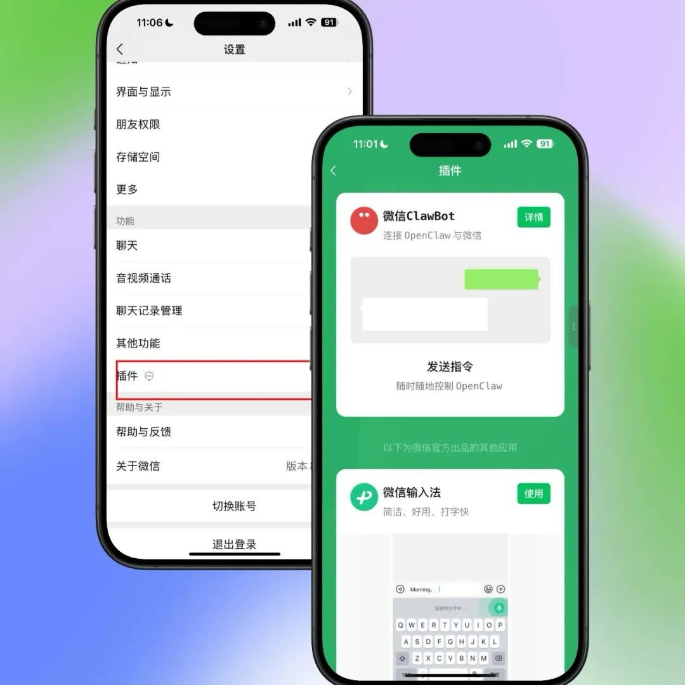
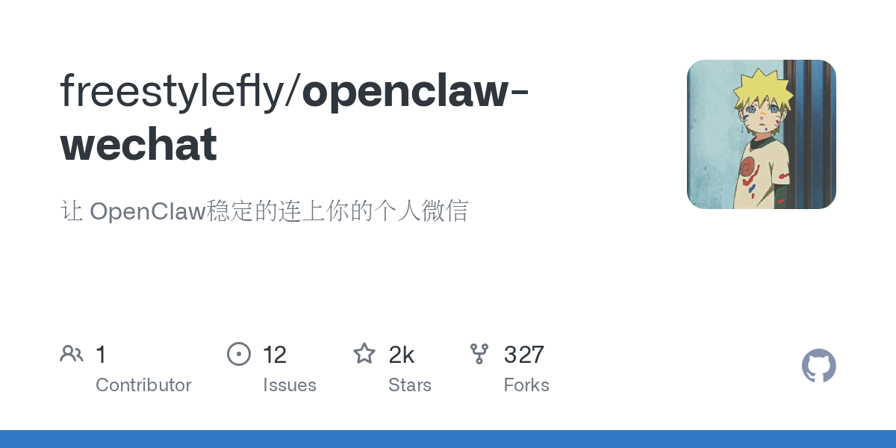

# AI 助手开始接入微信了，真正的变化不是聊天更方便

前两天那篇，我写的是判断。

今天这篇，我直接把它改成实操版。

因为很多人看完之后，真正关心的已经不是“这事值不值得关注”，而是另一句更直接的话：

**到底怎么把 AI 助手接进微信？**

先把结论说在前面。

AI 接入微信，表面看像是“多了一个聊天入口”，但真正的变化不是聊天更方便，而是：

**AI 开始进入中国人最真实、最高频、也最私密的关系链和日常场景。**

一旦这件事走通，AI 就不再只是网页上的一个对话框。

它会慢慢变成一个常驻在你消息流、联系人、工作协作和生活沟通里的助手。

所以，这篇不讲空话，直接讲怎么装、怎么配、怎么排错。



# 微信 OpenClaw 安装配置指南

本文档总结了微信 OpenClaw 插件的完整安装、授权和配置流程。

---

## 一、安装微信插件

先把插件装上。

```bash
# 安装微信插件
openclaw extension add @tencent-weixin/openclaw-weixin

# 或使用 npm 安装
npm install -g @tencent-weixin/openclaw-weixin
```

这一步本质上就是把微信渠道接入 OpenClaw。

装完之后，后面的登录、授权和消息收发才有基础。

---

## 二、获取登录二维码

### 1. 生成二维码

```bash
openclaw weixin qrcode
```

**返回示例：**

```json
{
  "qrcode": "[QRCODE_REDACTED]",
  "url": "https://ilinkai.weixin.qq.com/cgi-bin/loginpage?qrcode=[QRCODE_REDACTED]"
}
```

### 2. 打开二维码链接

复制返回的 `url`，在浏览器中打开，会显示微信登录二维码。

### 3. 微信扫码授权

使用微信扫描页面上的二维码，在手机上确认授权登录。

这一步可以理解成：

**先把你的微信身份和插件绑定起来。**

没有这一步，后面拿不到可用的 Token。

---

## 三、查询登录状态并获取 Token

扫码授权后，查询二维码状态获取 Token：

```bash
# 替换 <qrcode> 为实际二维码值
curl -s "https://ilinkai.weixin.qq.com/ilink/bot/get_qrcode_status?qrcode=<qrcode>"
```

**成功返回示例：**

```json
{
  "baseurl": "https://ilinkai.weixin.qq.com",
  "bot_token": "[BOT_ID_REDACTED]:[TOKEN_REDACTED]",
  "ilink_bot_id": "[BOT_ID_REDACTED]",
  "ilink_user_id": "[USER_ID_REDACTED]",
  "ret": 0,
  "status": "confirmed"
}
```

**关键字段：**

- `bot_token`: 完整 Token（包含 accountId 和密钥）
- `ilink_bot_id`: 机器人账户 ID
- `ilink_user_id`: 绑定的微信用户 ID
- `baseurl`: API 基础地址

这里最重要的是把几个核心值记下来，尤其是：

- `bot_token`
- `ilink_bot_id`
- `ilink_user_id`

后面配置文件全靠它们。

---

## 四、配置文件

### 1. 目录结构

```text
$OPENCLAW_STATE_DIR/openclaw-weixin/
├── accounts.json                    # 账户索引文件
└── accounts/
    └── <accountId>.json            # 单个账户配置
```

> **注意：** `OPENCLAW_STATE_DIR` 默认为 `~/.openclaw`，但在当前环境中为 `/home/gem/workspace/agent`

这块很关键。

很多人不是配错内容，而是**文件放错位置**，结果系统根本读不到。

### 2. 创建账户索引文件

**文件：** `$OPENCLAW_STATE_DIR/openclaw-weixin/accounts.json`

**格式（JSON 数组）：**

```json
[
  "[BOT_ID_REDACTED]"
]
```

### 3. 创建账户详情文件

**文件：** `$OPENCLAW_STATE_DIR/openclaw-weixin/accounts/<accountId>.json`

**示例：** `accounts/[BOT_ID_REDACTED].json`

```json
{
  "token": "[BOT_ID_REDACTED]:[TOKEN_REDACTED]",
  "savedAt": "2026-03-22T12:50:00.000Z",
  "baseUrl": "https://ilinkai.weixin.qq.com",
  "userId": "[USER_ID_REDACTED]"
}
```

**字段说明：**

- `token`：必填，从扫码结果获取的完整 `bot_token`
- `savedAt`：可选，保存时间戳（ISO 8601 格式）
- `baseUrl`：必填，API 基础地址，默认 `https://ilinkai.weixin.qq.com`
- `userId`：可选，绑定的微信用户 ID

这一段说白了，就是把扫码拿到的登录凭据，正式落进 OpenClaw 能读取的账户结构里。



---

## 五、启用微信渠道

### 1. 启用渠道配置

```bash
openclaw config set channels.openclaw-weixin.enabled true
```

### 2. 配置基础 URL（如需要）

```bash
openclaw config set channels.openclaw-weixin.baseUrl "https://ilinkai.weixin.qq.com"
```

### 3. 验证配置

```bash
openclaw config get channels.openclaw-weixin
```

如果你前面文件都放对了，这一步就是把微信渠道真正打开。


---

## 六、重启服务

配置完成后必须重启 Gateway 才能生效：

```bash
sh scripts/restart.sh
```

或：

```bash
openclaw gateway restart
```

这一点非常容易被忽略。

**很多人明明都配对了，但就是忘了重启。**

结果就是：文件看着都有，状态还是不对。

---

## 七、验证状态

### 1. 检查健康状态

```bash
openclaw health
```

**期望输出：**

```text
Feishu: ok
openclaw-weixin: configured
```

### 2. 检查渠道状态

```bash
openclaw status
```

**期望输出：**

```text
│ openclaw-weixin │ ON      │ OK     │ token configured · accounts 1/1 │
```

看到这一步，基本就说明微信接入跑通了。

---

## 八、常见问题与注意事项

### ⚠️ 重要提醒

#### 1. 账户文件位置必须正确

- 索引文件：`$OPENCLAW_STATE_DIR/openclaw-weixin/accounts.json`
- 账户详情：`$OPENCLAW_STATE_DIR/openclaw-weixin/accounts/<accountId>.json`
- 不要放错位置，否则无法加载

#### 2. 账户索引文件格式

必须是 **JSON 数组**，不是对象。

- ❌ 错误：`{"accounts": ["xxx"]}`
- ✅ 正确：`["xxx"]`

#### 3. 账户详情文件字段

不要包含 `accountId` 字段（新版本已移除）。

只需包含 `token`, `baseUrl`, `userId` 等。

#### 4. 重启才能生效

修改配置或账户文件后必须重启 Gateway。

仅保存文件不会自动生效。

#### 5. 环境变量

确保 `OPENCLAW_STATE_DIR` 环境变量正确设置。

检查命令：

```bash
echo $OPENCLAW_STATE_DIR
```

### 🔧 问题排查

| 问题 | 排查步骤 |
|------|----------|
| 状态显示 `no token` | 检查账户文件是否在 `accounts/` 子目录下；检查索引文件格式是否为数组 |
| 状态显示 `SETUP` | 确认已执行 `openclaw config set channels.openclaw-weixin.enabled true` |
| 状态显示 `not configured` | 确认账户索引文件和详情文件存在且格式正确；确认已重启 Gateway |
| 找不到账户 | 检查 `OPENCLAW_STATE_DIR` 环境变量；检查文件路径是否正确 |

这部分你别嫌啰嗦。

真正折腾过一次就知道，**大多数问题都不是复杂 bug，而是路径、格式、重启这三件小事。**


### 📝 快速验证命令

```bash
# 1. 检查环境变量
echo $OPENCLAW_STATE_DIR

# 2. 检查文件结构
ls -la $OPENCLAW_STATE_DIR/openclaw-weixin/
ls -la $OPENCLAW_STATE_DIR/openclaw-weixin/accounts/

# 3. 检查账户索引
cat $OPENCLAW_STATE_DIR/openclaw-weixin/accounts.json

# 4. 检查账户详情
cat $OPENCLAW_STATE_DIR/openclaw-weixin/accounts/<accountId>.json

# 5. 检查渠道配置
openclaw config get channels.openclaw-weixin

# 6. 检查服务状态
openclaw health
openclaw status
```

---

## 九、完整流程速查

如果你只想看最短路径，直接照着这个顺序走：

```bash
# 1. 安装插件
openclaw extension add @tencent-weixin/openclaw-weixin

# 2. 获取二维码
openclaw weixin qrcode
# → 复制 url 到浏览器，微信扫码

# 3. 查询状态获取 token
curl -s "https://ilinkai.weixin.qq.com/ilink/bot/get_qrcode_status?qrcode=<qrcode>"
# → 记录 bot_token, ilink_bot_id, ilink_user_id

# 4. 创建目录
mkdir -p $OPENCLAW_STATE_DIR/openclaw-weixin/accounts

# 5. 创建账户索引文件
echo '["<ilink_bot_id>"]' > $OPENCLAW_STATE_DIR/openclaw-weixin/accounts.json

# 6. 创建账户详情文件
cat > $OPENCLAW_STATE_DIR/openclaw-weixin/accounts/<ilink_bot_id>.json << 'EOF'
{
  "token": "<bot_token>",
  "savedAt": "$(date -u +%Y-%m-%dT%H:%M:%S.%3NZ)",
  "baseUrl": "https://ilinkai.weixin.qq.com",
  "userId": "<ilink_user_id>"
}
EOF

# 7. 启用渠道
openclaw config set channels.openclaw-weixin.enabled true

# 8. 重启服务
sh scripts/restart.sh

# 9. 验证
openclaw health
```

---

## 十、参考信息

- **插件文档**: `extensions/openclaw-weixin/README.md`
- **账户逻辑**: `extensions/openclaw-weixin/src/auth/accounts.ts`
- **OpenClaw 配置**: `openclaw.json`
- **环境变量**: `OPENCLAW_STATE_DIR`

---

## 最后一句

AI 助手开始接入微信，这件事表面看像是把聊天入口搬了一下。

但真正的变化不是聊天更方便。

而是：

**AI 开始进入你最真实的沟通场景，开始接触你的联系人、关系链、消息流和工作流。**

这一步一旦走通，后面比的就不只是模型聪不聪明。

还会比谁更稳、谁更懂边界、谁更懂场景、谁更适合长期待在真实入口里。

这才是它真正值得高看一眼的地方。

以上，既然看到这里了，如果觉得不错，随手点个赞、在看、转发三连吧，如果想第一时间收到推送，也可以给我个星标⭐～谢谢你看我的文章，我们，下次再见。
