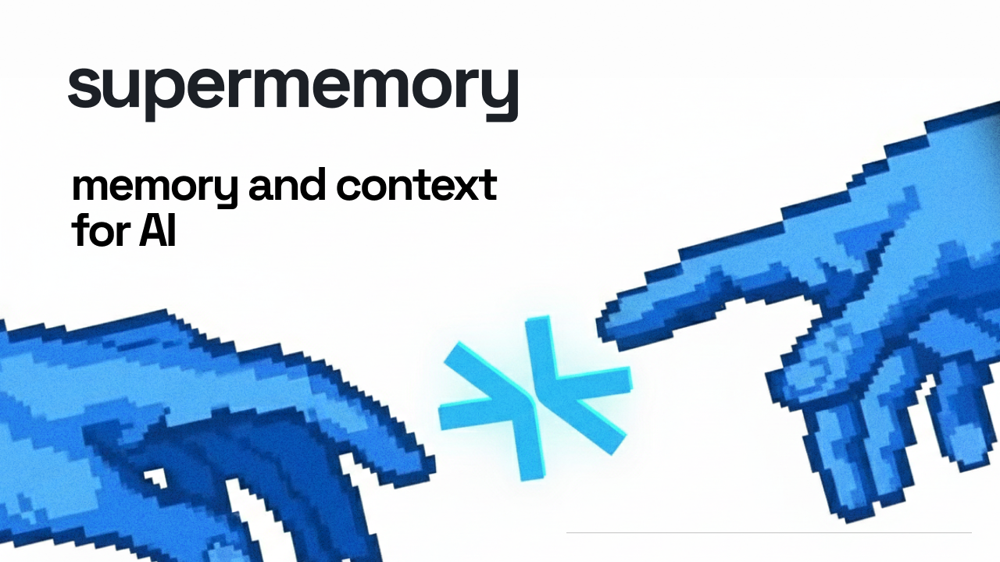
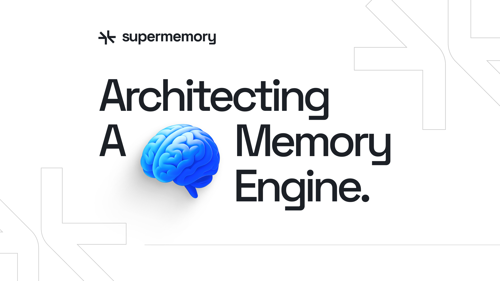
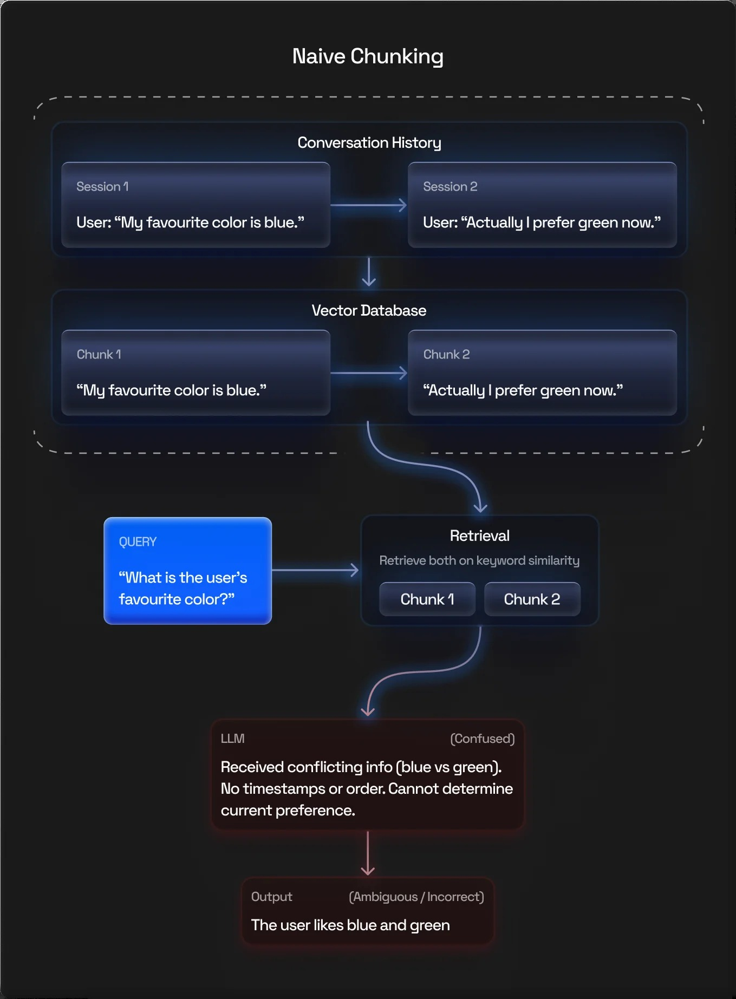

# AI 终于开始有“永久记忆”了，真正的变化不是它记住更多，而是它开始记住工作

这两天，AI 圈里一个话题突然又被炒热了：

**永久记忆。**

表面看，这事很好理解。

以前你和 AI 聊完一轮，它像失忆。

下一次再打开，很多背景、偏好、上下文，都得重新讲一遍。

而现在，越来越多产品开始在讲：

- 长期记忆
- 跨会话记忆
- 可继承记忆
- 持久上下文
- Memory layer

再加上一些跑分和基准测试，市场很容易就兴奋起来，觉得 AI 终于从“金鱼记忆”进化成了“永久记忆”。

但我觉得，这个话题真正值得写的，不是 AI 终于记住更多东西了。

而是：

**AI 开始从“会话工具”变成“能持续积累工作的系统”。**

这才是更大的变化。

## 为什么“记忆”会突然变成主战场

因为模型本身越来越强之后，大家已经开始发现一个很现实的问题：

**真正限制 AI 进入工作流的，不只是智商，而是连续性。**

你可以让 AI 一次性回答得很漂亮。

你也可以让它在一个长上下文窗口里看起来很聪明。

但只要任务拉长到几天、几周、几个月，问题就来了：

- 它还记不记得你之前定过什么规则
- 它还知不知道这个项目为什么这么做
- 它还分不分得清旧信息和新信息
- 它会不会把过时结论继续当事实用
- 它能不能真正形成“长期协作”能力

说白了，很多 AI 现在最大的问题不是不会回答。

而是**不能稳定延续。**

这也是为什么记忆会突然变成核心战场。

因为一旦 AI 真要进入真实工作，它最先要补的，不是参数，而是记忆。

## 真正重要的，不是“记住一切”，而是“记住对的东西”

很多人一听永久记忆，第一反应是：

是不是以后 AI 什么都不会忘了？

但这事如果真这么干，反而会出大问题。

因为人类记忆本来就不是把所有东西原封不动存下来。

真正有用的记忆，一定带筛选。

AI 也一样。

真正好的记忆系统，不是“全记住”。

而是至少要解决这几件事：

- 什么该记
- 什么不该记
- 什么该长期保留
- 什么该随时间衰减
- 什么是偏好
- 什么是事实
- 什么已经过期
- 什么互相冲突

如果没有这一层，所谓永久记忆，很容易变成另一种灾难：

**它不是更聪明，而是更容易带着旧错误一路跑下去。**

所以现在很多记忆系统真正比拼的，不只是存储能力。

而是：

**检索、组织、去噪、冲突处理、时间感和优先级。**

## 这波“永久记忆”真正推动的，不是聊天体验，而是工作体验

这也是我最想强调的一点。

如果你只是把 AI 当聊天机器人，那记忆提升带来的变化，大概是：

- 它更懂你
- 它少问重复问题
- 它能记住你的偏好
- 对话更顺

这些当然都很好。

但真正的大变化，不在这里。

真正大的变化在于，AI 一旦拥有可用的长期记忆，它就开始更像一个真正能参与工作的助手。

比如它可以慢慢记住：

- 你写公众号的风格
- 你项目里长期不变的规则
- 你做判断时最看重哪些维度
- 你不喜欢哪些表达方式
- 你一个任务通常怎么推进
- 某个项目的历史决策为什么是那样

这时候，AI 就不再只是每次“重新上岗”的临时工。

它开始像一个真的跟你一起干活的人。

而这，才是永久记忆真正让人后背发凉的地方。

因为它带来的不是更顺滑的聊天。

而是**更接近持续协作。**

## 为什么现在很多记忆产品都在冲基准测试

因为记忆这件事，太容易吹了。

谁都可以说自己“更懂你”“长期记住你”“跨会话持续工作”。

但如果没有基准测试，很难知道它到底是真的强，还是只是 demo 漂亮。

所以现在你会看到越来越多项目开始强调：

- 在 LongMemEval 上的成绩
- 在长会话、多轮任务里的表现
- 在冲突信息环境中的稳定性
- 在高噪声、多历史记录条件下的检索准确率

这其实是好事。

因为它意味着“AI 记忆”开始从概念词，往工程问题走。

从这个角度看，所谓 99%、SOTA 这些数字，值不值得看？

值。

但它们真正的意义，不是告诉你“问题已经解决了”。

而是告诉你：

**记忆已经从边角功能，正式变成主赛道。**

## 接下来最值钱的 AI，不一定是最聪明的，而是最能延续的

我越来越觉得，下一阶段 AI 的竞争，不会只是比：

- 谁会推理
- 谁会写代码
- 谁会生成图片
- 谁上下文更长

而会越来越多地比：

- 谁更能长期记住任务
- 谁更能积累用户偏好
- 谁更能把历史经验变成未来效率
- 谁更能在长期协作里不掉链子

这会直接改变很多产品的估值逻辑。

因为从用户角度看，一个再聪明但每次都失忆的 AI，始终像工具。

而一个能够持续记住、持续适应、持续协作的 AI，才会慢慢变成助手。

工具和助手，差别其实就在这里。

## 最后

所以这波“AI 获得永久记忆”，最值得看的，不是一句听上去很炸的话。

真正值得看的是：

**AI 正在从一次性会话工具，变成能持续积累上下文、偏好、规则和工作方式的系统。**

这一步一旦走通，很多产品的边界都会被改写。

以前我们用 AI，是每次重新开始。

以后我们跟 AI 合作，可能会越来越像：

**和一个真正记得你怎么做事、为什么这么做、接下来该做什么的长期搭档一起工作。**

到那时，决定胜负的，可能就不只是模型够不够强了。

而是谁的记忆系统，真的能让 AI 持续干活。

这才是“永久记忆”背后，最该被高看的地方。

以上，既然看到这里了，如果觉得不错，随手点个赞、在看、转发三连吧，如果想第一时间收到推送，也可以给我个星标⭐～谢谢你看我的文章，我们，下次再见。
