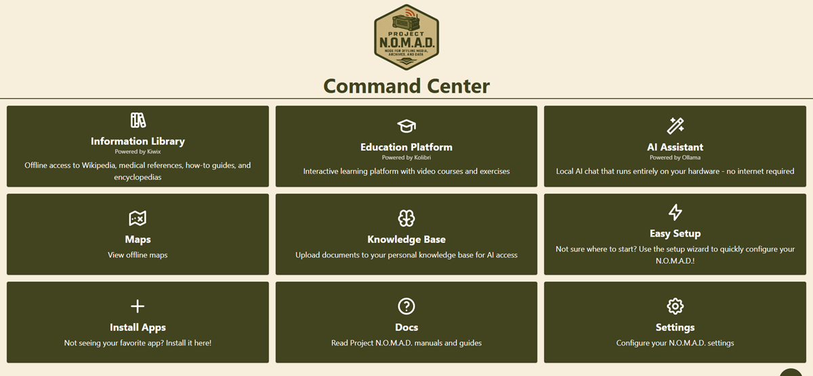
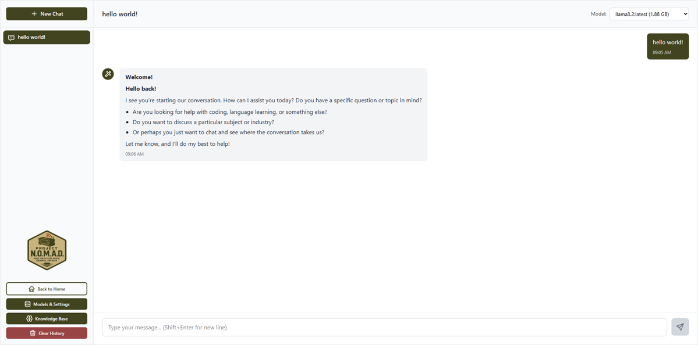
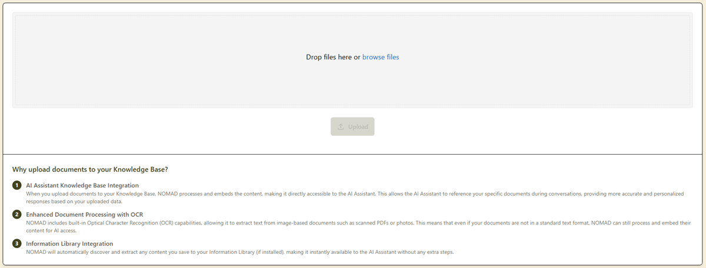
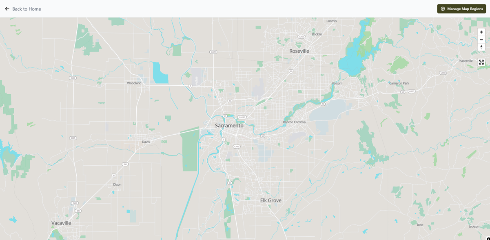

# 今天 GitHub 热度第一，不是新模型，而是一台“离线 AI 生存电脑”

今天 GitHub 热度冲到最前面的，不是什么新模型，也不是什么更高分的论文复现。

而是一个叫 **Project N.O.M.A.D.** 的项目。

它今天新增大概 **2294 stars**，直接冲到了热榜前面。

如果只看名字，你可能会以为这又是一个普通的开源整活项目。

但它真正有意思的地方在于：

**它想做的不是一个聊天机器人，也不是一个单点 AI 工具，而是一整套离线可运行的知识、教育、地图和本地 AI 系统。**

说得更直接一点：

它想把“断网之后还能不能继续用 AI 和知识工具”这件事，做成一台真正能落地的系统。

## 它为什么突然这么火

因为它踩中的不是一个小需求，而是一种越来越强的情绪：

**大家开始重新看重“离线、本地、可控、自主”的 AI 系统。**

过去两年，AI 世界最热的叙事基本都围着云端打转：

- 谁模型更强
- 谁 API 更便宜
- 谁上下文更长
- 谁生成效果更炸

但 Project N.O.M.A.D. 代表的是另一种思路。

它问的不是：

“你能不能接上最强模型？”

而是：

**“如果网络不稳定、平台不可用、或者你就是想本地可控，那你还能不能有一整套能继续工作的 AI 和知识系统？”**

这就一下子把项目从“工具层”抬到了“系统层”。

## 这项目到底是干什么的

从公开介绍看，Project N.O.M.A.D. 本质上是一套 **offline-first** 的知识与教育服务器。

它不是一个单独 App，而更像一个本地指挥中心，把很多常见能力揉在一起：

- 本地 AI 聊天
- 文档上传 + 语义检索
- 离线 Wikipedia / 医学资料 / 电子书
- 离线地图
- 可跟踪进度的教育课程
- 数据处理工具
- 本地笔记系统
- 硬件跑分和社区榜单

而且它主打一个点很鲜明：

**安装完后，大部分东西可以在浏览器里直接用，不需要你再到处拼。**

这比单独装一堆 Ollama、Kiwix、Kolibri、Qdrant、CyberChef，更容易打动人。

因为绝大多数人真正缺的，不是某个组件。

而是：

**一套装上就能跑的完整系统。**

## 它最狠的地方，不是“离线”，而是“打包成系统”

离线知识库、离线地图、本地模型，这些东西以前不是没有。

但以前大多数时候，它们都是分散的。

你要自己找：

- 本地模型怎么跑
- 向量库怎么接
- Wikipedia 离线包怎么下
- 地图数据怎么导
- 课程系统怎么装
- 前端入口怎么统一

对普通人来说，光想到这些就头大了。

Project N.O.M.A.D. 最值钱的地方，不是重新发明了某个底层技术。

而是它在做一件更现实的事：

**把这些原本散落的能力，包装成一套“普通人也能装、也能理解、也能用”的离线 AI 生存系统。**

这一点特别重要。

因为开源世界里，很多项目技术上没问题，但就是不成系统。

而一旦不成系统，传播力和使用门槛就会立刻拉开。

## 为什么 GitHub 会给它这么高热度

因为它同时踩中了好几条现在很热的线。

### 第一条：本地 AI

越来越多人不想把一切都交给云端模型。

他们在意：

- 隐私
- 成本
- 可控性
- 长期可用性

Project N.O.M.A.D. 里本地 AI 这一块，正好对上这个趋势。

### 第二条：离线知识

AI 很强，但一断网，很多东西就直接没了。

而这个项目把 Wikipedia、医学资料、电子书、课程这些内容都往离线方向做，等于把“知识可用性”这件事补上了。

### 第三条：生存 / 备灾 / 低依赖系统

这两年越来越多技术项目，背后都有一个隐形情绪：

**如果平台失效、网络中断、环境不稳定，我还能不能保留自己的信息能力？**

Project N.O.M.A.D. 很明显就是踩中这条线了。

### 第四条：一体化产品感

很多开源项目不缺能力，缺的是“像产品”。

这个项目能冲高，一个很重要原因是它给人的感觉不是零件，而是一个完整方案。

## 这个项目真正值钱的，不是给末日用，而是给现实世界用

很多人一看到“survival computer”这种说法，会下意识把它当成末日题材。

但我觉得，这反而低估了它。

它真正值钱的，不是末日感。

而是它其实击中了现实里非常普通的场景：

- 家里想搭一个本地知识中心
- 学校或培训环境需要离线教育系统
- 野外、低网、断网环境下需要地图和资料
- 对隐私敏感，不想什么都丢给云端
- 想给团队搞一套本地 AI + 知识系统原型

也就是说，它表面在卖“极端场景”。

但真正能让它传播开的，往往是普通场景下的实用性。

这才是聪明的地方。

## 它也暴露出一个趋势：AI 产品开始从云端回流到本地系统

我觉得 Project N.O.M.A.D. 这次冲热榜，背后最值得注意的一点是：

**AI 世界正在出现一波“从纯云端回流到本地系统”的需求。**

不是大家不要云了。

而是越来越多人开始觉得：

- 核心能力最好能有本地备份
- 关键知识最好别完全依赖平台
- 真正重要的工具，最好自己能掌控

这种变化现在还没有完全成为主流叙事。

但在 GitHub 这种开发者投票场里，已经能看到信号了。

今天热度第一不是模型，而是一整套离线 AI 系统，本身就很说明问题。

## 最后

Project N.O.M.A.D. 今天能冲上 GitHub 热榜前面，表面看是因为它题材特别。

但更深一点看，它真正踩中的，是今天 AI 世界里一个越来越强的共识：

**大家想要的，已经不只是一个更聪明的模型，而是一套更可控、更完整、更能独立运行的系统。**

从这个角度看，Project N.O.M.A.D. 值得关注的就不只是“离线生存电脑”这个标签。

而是它提醒了所有人：

**下一阶段真正值钱的 AI，不一定只在云上，也可能是一套你自己握在手里的本地系统。**

这才是它今天热度这么高，真正该看的地方。

以上，既然看到这里了，如果觉得不错，随手点个赞、在看、转发三连吧，如果想第一时间收到推送，也可以给我个星标⭐～谢谢你看我的文章，我们，下次再见。
