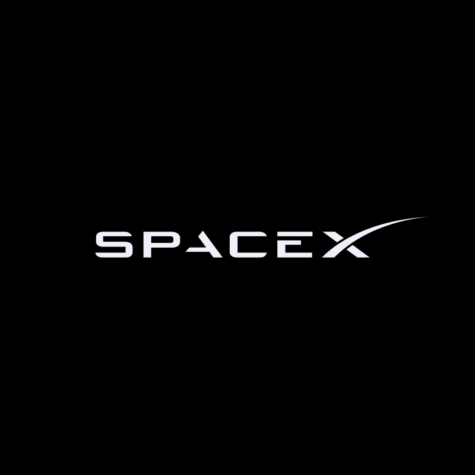
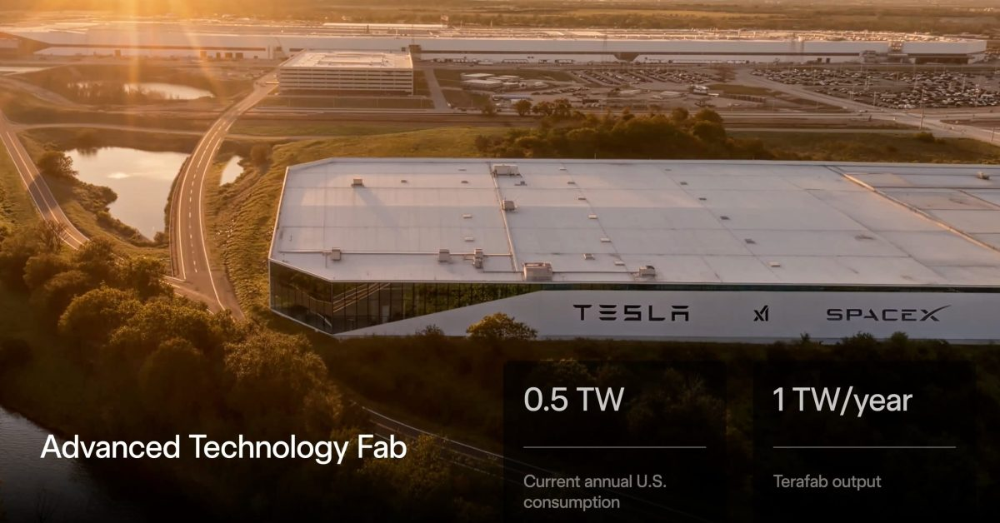
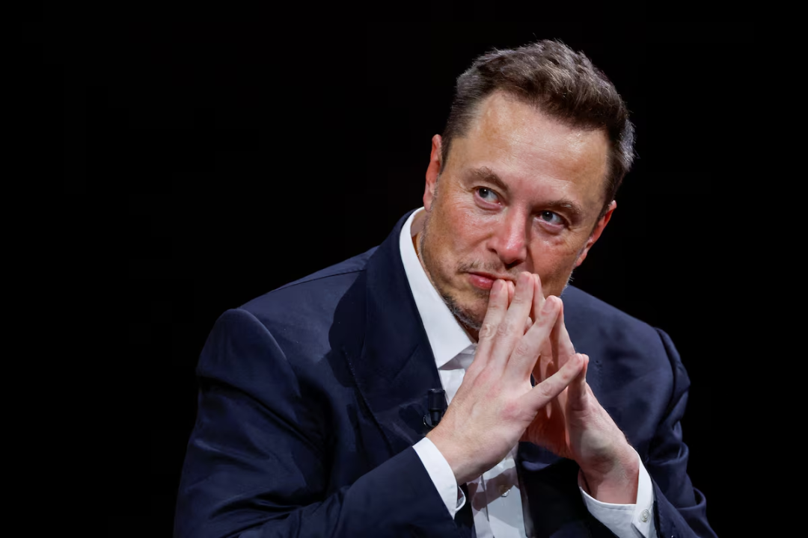

# 马斯克启动 TERAFAB，不只是要自己造芯片，而是想把 AI 算力厂开到太空前夜

马斯克又扔了一颗很大的炸弹。

这次不是火箭，也不是机器人，而是一个名字听起来就很像科幻片的项目：**TERAFAB**。

从公开描述看，这个项目的关键词非常夸张：

- 太瓦级算力产能
- 芯片制造内部化
- 特斯拉、SpaceX、xAI 一起下场
- 目标不只是地面 AI，还盯着太空算力基础设施

如果只把它理解成“马斯克又要自己造芯片了”，其实有点低估了这件事。

因为 TERAFAB 真正值得写的，不只是它想造多少芯片。

而是它背后暴露出一个更凶的趋势：

**AI 竞争正在从模型战、产品战，继续升级到能源战、制造战和基础设施主权战。**

## 马斯克这次想要的，不是买更多 GPU，而是自己控制算力源头

过去几年，AI 行业有一条很明显的线：

谁能买到更多 GPU，谁就更有主动权。

但当所有人都开始卷模型、卷训练、卷推理、卷 Agent 之后，问题就变了。

真正卡脖子的，慢慢不再只是“有没有模型”，而是：

- 有没有足够稳定的芯片供给
- 有没有足够低成本的算力
- 有没有足够快的部署能力
- 有没有不受别人掐脖子的制造能力

这就是为什么 TERAFAB 这个项目，会这么有马斯克味道。

他不想只是继续在市场上排队买卡。

他想要的是更狠的一步：

**把 AI、机器人、自动驾驶、太空计算这些未来业务，尽可能绑定在自己可控的芯片和算力体系里。**

## 这不是普通晶圆厂叙事，而是“算力工厂”叙事

TERAFAB 这个名字本身就很说明问题。

它不是在强调制程，不是在强调某个单一芯片型号。

它强调的是 **Tera** —— 太瓦级。

这意味着它卖的概念，已经不是“我能做多少颗芯片”，而是：

**我一年能吐出多少真实可用的计算能力。**

这个变化很关键。

因为 AI 时代最值钱的东西，不再只是芯片本身。

而是芯片、封装、电力、散热、网络、数据中心、软件栈、调度系统一起构成的那台“算力机器”。

说白了，未来真正的竞争单位，不是一张卡，也不是一个模型。

而是一整座能持续生产 Token、训练模型、跑 Agent 的工厂。

从这个角度看，TERAFAB 根本不像传统半导体项目。

它更像是马斯克版的 **AI 工业母机**。

## 为什么他要把 Tesla、SpaceX、xAI 绑在一起

这件事还有一个很狠的地方：

它不是单独为某一家业务服务。

而是把马斯克手里几条最重的线，开始往同一个基础设施底盘上压。

### Tesla 要什么？

Tesla 要的是：

- 自动驾驶
- Optimus 机器人
- 车端和云端协同
- 大规模推理和训练能力

### xAI 要什么？

xAI 要的是：

- 训练更大的模型
- 支撑更多推理调用
- 跟 OpenAI、Google、Anthropic 拼基础设施规模

### SpaceX 要什么？

SpaceX 要的则更长线：

- 星链网络
- 航天任务的数据处理
- 更远一步，太空中的计算与基础设施节点

把这三条线放一起，你就会发现 TERAFAB 的野心根本不是“做一个工厂”。

而是：

**先把地面上的 AI、机器人、汽车、航天都压进同一个算力体系，再往更大的空间基础设施叙事走。**

这也是为什么“瞄准太空”这件事，听起来离谱，但又不是完全胡说。

因为一旦你真的把能源、制造、芯片、网络和模型绑成一个系统，往太空延展只是时间问题。

## 这件事真正吓人的地方，在于它把 AI 竞争又往下压了一层

很多人现在还在看 AI 新闻时盯着这些表层：

- 谁又发了新模型
- 谁跑分更高
- 谁上下文更长
- 谁视频更强

但 TERAFAB 这种项目最值得警惕的，是它在提醒市场：

**上面的模型竞争再热闹，最后都要回到下面的制造、供电和基础设施。**

如果未来几年最强的 AI 玩家，不只是模型公司，而是同时控制：

- 芯片
- 电力
- 数据中心
- 网络
- 机器人
- 应用入口

那行业格局会比现在残酷得多。

因为这意味着，AI 不再只是软件行业的战争。

它正在重新变成一场重工业战争。

## TERAFAB 最像什么？

我觉得它最像的，不是普通意义上的芯片厂。

它更像是马斯克想给自己未来十年的业务，提前打的一根地基桩。

这根桩支撑的不是一个产品。

而是一整套世界观：

- 车要更智能
- 机器人要更普及
- 模型要更大
- Token 要更便宜
- 算力要更密集
- 最后连太空都要成为计算基础设施的一部分

你可以质疑它会不会真做成。

也可以质疑它是不是又在先吹再干。

但有一点很难否认：

**当别人还在争“哪家模型更聪明”时，马斯克已经在把问题改写成“谁能控制未来的算力工厂”。**

## 这对整个 AI 行业意味着什么

如果 TERAFAB 不是一句口号，而是真的往前推进，那它至少会带来三层影响。

### 第一层：AI 基础设施竞争继续升级

未来拼的不会只是 GPU 数量。

而是完整的：

- 芯片制造能力
- 供电能力
- 建厂速度
- 调度效率
- 单位 Token 成本

### 第二层：模型公司会越来越像重资产公司

过去很多人觉得 AI 公司像软件公司。

但如果算力、制造和能源越来越重要，AI 公司会越来越像：

**半导体 + 云计算 + 能源 + 工业系统** 的混合体。

这就不是轻公司故事了。

### 第三层：太空叙事不再只是噱头

只要星链、航天通信、边缘计算和极端环境部署这些线继续往前走，太空算力这件事迟早会被认真讨论。

现在听着像科幻，几年后未必还是。

## 最后

TERAFAB 这个项目，表面看是在讲芯片工厂。

但它真正讲的，其实是另一件事：

**AI 时代最值钱的，不只是模型能力，而是把能源、芯片、制造、网络和应用一起组织起来的能力。**

谁能控制这套系统，谁就更有可能控制下一轮 AI 工业化的节奏。

所以这条新闻最该注意的地方，不是“马斯克又吹了个多大的牛”。

而是：

**AI 行业的战争，已经从聊天框后面，往电厂、晶圆厂和航天基础设施里走了。**

这才是 TERAFAB 真正让人后背发凉的地方。

以上，既然看到这里了，如果觉得不错，随手点个赞、在看、转发三连吧，如果想第一时间收到推送，也可以给我个星标⭐～谢谢你看我的文章，我们，下次再见。
