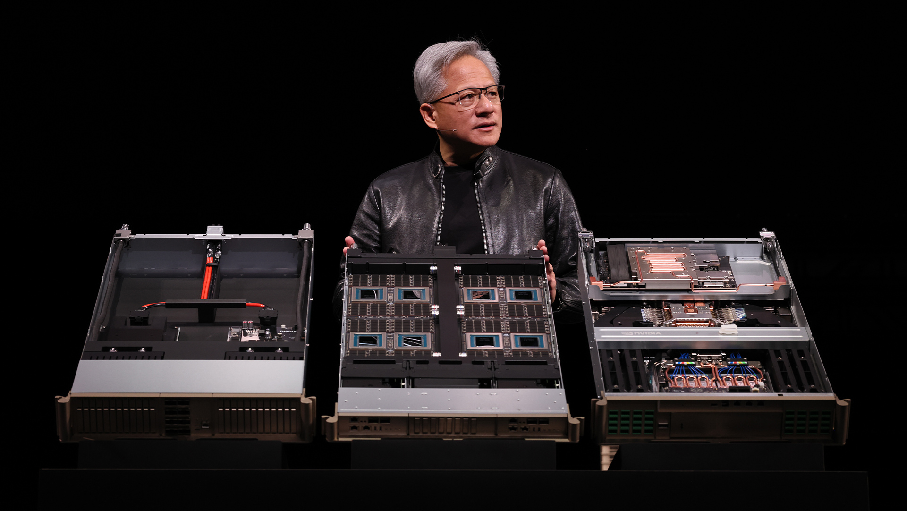
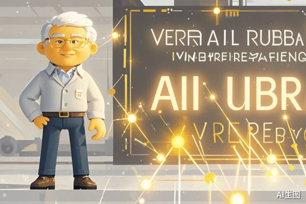
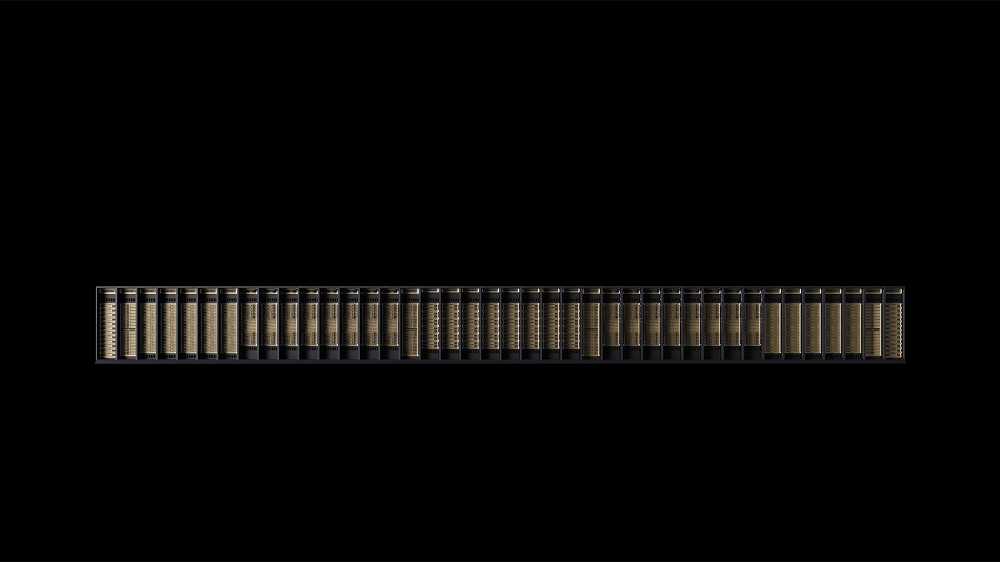
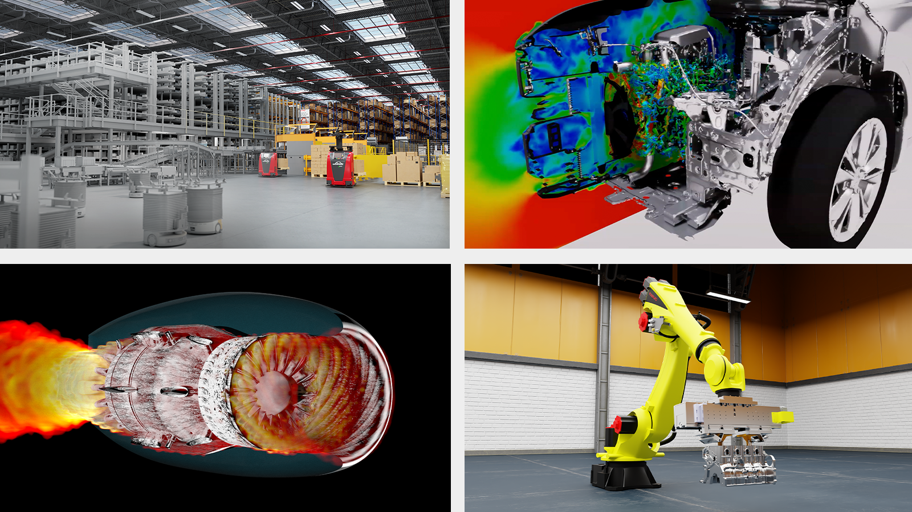

# Token 要写进工资条了，硅谷开始按“AI 火力”重新定价员工

这两天有个话题很炸。

黄仁勋提到，未来公司给工程师开的 offer，可能不只是年薪和股票，**还会写上 Token 额度**。

听上去像段子。

但如果把它和最近硅谷的另一种现象放在一起看，你会发现这事一点也不搞笑，反而很现实：

**AI 时代，公司开始重新定义“一个员工到底值多少钱”。**

以前大家算的是工资、电脑、工位、差旅。

现在越来越多团队开始算另一笔账：

- 这个人每个月能消耗多少 Token
- 这些 Token 能换来多少代码、分析、图像、研究和决策支持
- 一个人带着一套 AI 工具之后，产出到底能被放大几倍

说白了，**Token 正在从 API 成本，慢慢变成生产资料。**

## 以前公司给你发工资，现在公司还得给你发“AI 弹药”

黄仁勋这个说法最值得注意的地方，不是“发 Token”本身。

而是它背后的逻辑变了。

过去公司招一个工程师，默认配置大概是：

- 一台电脑
- 几个软件账号
- 一套内部系统权限
- 一笔固定工资

这些东西本质上都是工具。

但到了 AI 时代，Token 不再只是“工具订阅费”那么简单。

它更像是一种**直接决定个人战斗力的资源配额**。

你给一个普通工程师配一台更好的电脑，效率可能提升 10%。

但你如果给他一套足够强的模型、一套足够高的上下文额度、再加一套能接工作流的 Agent 工具，提升往往不是 10%，而是直接把工作方式改了。

于是公司开始发现：

**未来真正稀缺的，不只是会用 AI 的人，而是“能稳定、高效、低浪费地把 Token 变成结果的人”。**

这就意味着，Token 很可能会像云资源预算、广告预算、销售线索预算一样，成为组织里一项明确的经营资源。

## 一人一周烧掉 33 个维基百科，不是夸张，是新现实

另一个更刺激的点，是“刷量”。

过去大家说一个团队烧钱，往往是：

- 烧服务器
- 烧 GPU
- 烧广告
- 烧人力

现在越来越多 AI 团队先烧的是 Token。

有人一周消耗的文本量，已经能用“相当于 33 个维基百科”来形容。

这说明什么？

说明 AI 的使用方式，正在从“偶尔问一下”变成“持续吞吐”。

尤其是下面几类场景，Token 消耗会非常夸张：

- 让 Agent 持续读网页、读文档、读代码库
- 长上下文分析和反复推理
- 多轮生成、反复改写、批量调用
- 多个子代理并行跑任务
- 图文音视频混合处理

一旦团队开始把 AI 真接进业务流里，Token 就会像水电煤一样，变成一种持续消耗的基础资源。

这也是为什么黄仁勋会把“Token 预算”讲得那么自然。

因为从公司视角看，**AI 已经不是点缀，而是工位的一部分。**

## 真正变化的，不是成本，而是组织对人的估值方式

很多人看到这里，第一反应是：那不就是成本上涨吗？

其实没那么简单。

更深一层的变化是：

**公司可能会开始按“人 + AI 组合体”的产出重新估值。**

以前一个人的边界，大致由他的经验、精力和工作时长决定。

现在一个人的边界，越来越取决于：

- 他会不会拆任务
- 他会不会写 prompt
- 他会不会选模型
- 他会不会管理上下文
- 他会不会把 Agent 接进工作流
- 他有没有足够的 Token 火力

于是未来公司招人，问的可能不只是：

“你会什么？”

还会变成：

“你会不会用 AI 把自己的上限拉开？”

甚至进一步变成：

“给你这笔 Token 预算，你到底能帮公司打出多大产出？”

这就很残酷了。

因为 AI 不只是提高效率。

它也在放大人与人之间的差距。

同样都是一个人、一天时间、同样模型可用，最后拉开差距的，不再只是能力本身，而是**对 AI 火力的调度能力**。

## Token 以后会像差旅标准、广告预算一样被管理

如果这个趋势继续走下去，接下来公司内部大概率会出现几件事：

### 1. Token 会被正式预算化

不是“你想用就用”，而是：

- 每个团队有额度
- 每个岗位有上限
- 每类任务有推荐模型和成本标准

### 2. 公司会开始统计“Token ROI”

老板不会只问你花了多少。

他一定会问：

- 烧了这么多 Token，换来了什么结果
- 哪个团队最会用
- 哪种任务最值得交给 AI
- 哪些调用纯属浪费

### 3. AI 使用习惯会变成职业能力的一部分

未来简历上很可能不只是写“熟悉 Python / Excel / PRD”。

而是会隐性比较：

- 你是不是一个高产的 AI 协作者
- 你能不能带着 Agent 跑复杂任务
- 你是不是值得公司给更多 Token 配额

这时候，Token 就不再只是技术词。

它会慢慢变成组织管理里的真货币。

## 这件事最值得普通人警惕的一点

很多人看到这种新闻，会觉得它只和硅谷、和大厂、和工程师有关。

但我觉得真正该警惕的是另一点：

**当 Token 变成工资的一部分时，AI 就不再是“辅助工具”，而是直接参与了劳动定价。**

这意味着接下来很多岗位的竞争，不是你和另一个人比。

而是你这个“人类单兵”，要去跟“别人 + 一整套 AI 火力系统”比。

如果你还把 AI 当成偶尔问问问题的聊天框，那你看到的是玩具。

如果公司已经开始把 Token 当预算、把 Agent 当工位配置，那它看的就是生产力。

两边根本不是一个时代。

## 最后

黄仁勋说“以后工资里可能会带 Token”，表面像一句很会传播的话。

但它真正点破的，是 AI 时代一个越来越清晰的现实：

**未来公司给员工配的不只是薪资、期权和设备，还会配 AI 火力。**

而一个人的市场价值，也会越来越取决于——

**你能不能把这些火力，真正打成结果。**

这才是这波 Token 讨论背后，最狠的地方。

以上，既然看到这里了，如果觉得不错，随手点个赞、在看、转发三连吧，如果想第一时间收到推送，也可以给我个星标⭐～谢谢你看我的文章，我们，下次再见。
