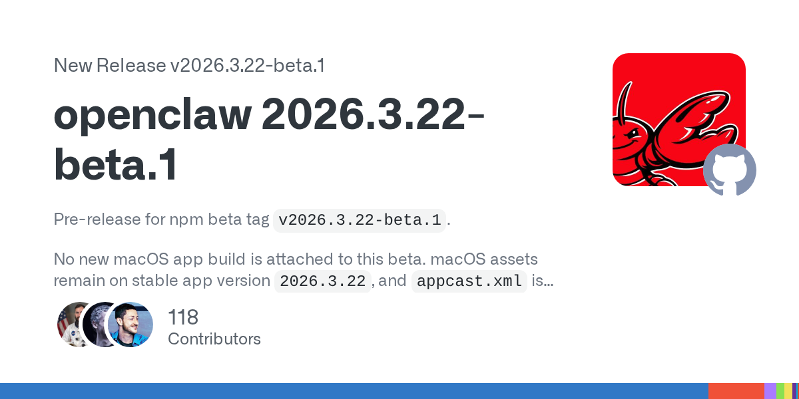
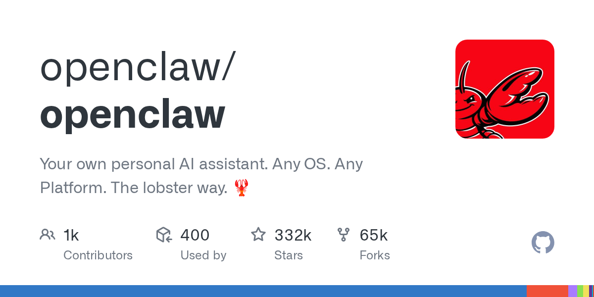

# OpenClaw 这次最猛升级，不是多了几个功能，而是底层开始像“应用商店级 AI 中枢”了

OpenClaw 这次更新，表面看起来像是一次常规版本发布。

但如果你把 release note 和 changelog 摊开看，会发现它干的不是“补几个功能”，而是一次很明显的**底层收束和架构重排**。

说直白点：

**它开始不只是想做一个能跑的 AI 助手框架，而是想往“可安装、可组合、可治理、可扩展”的 AI 中枢去走。**

这一步，比单纯多一个模型入口、多一个命令、多一个小功能值钱得多。

## 这次升级最值得看的，不是功能点，而是方向变了

很多人看版本更新，喜欢先盯“新增了什么”。

但 OpenClaw 这次更值得看的，是它删了什么、收了什么、标准化了什么。

从公开信息里，最有代表性的几条是：

- 插件安装开始优先走 **ClawHub**，不是继续把 npm 当唯一入口
- 旧的 Chrome extension relay 路径被明显弱化甚至移除
- 浏览器能力更倾向于走真实浏览器 / 直接连接 / 无头浏览器这条正路
- 一些老 SDK 路径、历史兼容逻辑开始被清理
- 安全边界继续收紧，默认行为更谨慎

这些动作放一起看，其实表达的是同一个意思：

> **OpenClaw 不想再无限背着历史包袱往前冲了，它开始主动做“收口”。**

而这种“收口”，往往才是一套系统真正成熟的前兆。

## 从“能装很多东西”，变成“怎么把安装体验做成一个生态”

我觉得这次最值得高看的一点，是它把插件 / skill 的感觉，开始往“应用商店化”推进了。

以前很多 Agent 框架的问题不是不能扩展，而是扩展体验很散：

- 有的走 npm
- 有的走 git clone
- 有的靠手动拷文件
- 有的文档说一套、实际目录又一套

技术上当然都能装。

但对普通用户来说，这种体验就很劝退。

OpenClaw 这次开始让 `openclaw plugins install <package>` 更优先走 ClawHub，本质上是在做一件很重要的事：

**把“扩展能力”从工程师手工活，慢慢收成产品体验。**

别小看这点。

AI 工具要真往大众走，最后拼的从来不只是底层能力，还包括：

- 你装东西方不方便
- 你能不能知道哪些扩展值得装
- 你装完之后会不会炸
- 整个生态是不是有秩序

这一步一旦走顺，OpenClaw 后面会比很多“能力很强但很散”的项目更有后劲。

## 浏览器这条线，也开始从“曲线救国”回到正路

这次另一个很关键的变化，是浏览器能力这条线明显在收束。

以前很多 Agent 产品为了拿到登录态和真实浏览器能力，会绕很多路：

- 扩展中转
- relay
- 奇怪的桥接层
- 一堆历史兼容逻辑

这些东西不是不能用，但稳定性、可维护性、调试体验，其实都不算漂亮。

OpenClaw 这次对 legacy Chrome extension relay 路径做减法，本质上是在承认一件事：

**浏览器能力最终还是应该尽量回到 CDP、真实浏览器连接、标准接口这条主线。**

这个判断我觉得是对的。

因为只要浏览器自动化真的进入长期使用阶段，最重要的不是“能不能勉强跑”，而是：

- 稳不稳
- 能不能调
- 会不会莫名断
- 能不能和现成浏览器环境共存

这次 OpenClaw 在这条线上做收口，其实是在给后面的浏览器工作流铺路。

## 为什么我说这不是升级，而是“底层换血”

因为它开始碰的是系统级问题，不是表层功能问题。

你看这类动作就知道了：

- 安装入口重排
- 插件生态路径收束
- 浏览器接入方式重构
- 旧路径清理
- 安全默认值加强
- 模块化和边界继续明确

这些都不是“为了发版本凑内容”。

这些是一个项目从“能跑”往“能长期维护、能规模扩展、能让别人放心接入”迈的动作。

说难听点，很多开源项目最擅长的是加功能，不擅长删包袱。

但真正成熟的系统，迟早都得学会：

**砍掉旧路径，统一新路径，减少例外，强化边界。**

OpenClaw 这次最值钱的，就在这里。

## 这次更新对普通用户意味着什么

如果你不是开发者，可能会觉得这些词都很底层。

但其实它最后都会反映到很现实的体验上：

- 装 skill 会不会更顺
- 浏览器能力会不会更稳
- 出问题时好不好排查
- 新功能会不会和旧逻辑打架
- 系统是不是越来越像“产品”，而不是“实验场”

所以这次更新虽然技术味很重，但它不是只对开发者有意义。

它真正影响的是：

**OpenClaw 后面会不会越来越像一个能长期托管你工作流的 AI 中枢。**

如果这条路走通，价值会比单点功能升级大得多。

## 我对这次升级的判断

一句话：

> **这次 OpenClaw 最猛的地方，不是又加了多少功能，而是它开始明显往“应用商店级生态 + 标准化浏览器能力 + 更硬的安全边界”这条路上收。**

这意味着它想解决的，已经不是“能不能做 Agent”，而是：

**怎么把 Agent 做成一个可持续、可扩展、可治理的系统。**

这一步，才是真正的底层换血。

## 最后

很多人看 AI 工具更新，只盯新增了哪个模型、哪个按钮、哪个 demo。

但我越来越觉得，真正拉开差距的，往往不是这些表层热闹。

而是：

- 你的架构是不是在收敛
- 你的生态是不是在成形
- 你的默认路径是不是越来越标准
- 你的历史包袱有没有被认真清掉

OpenClaw 这次更新真正猛的地方，就在这里。

它不是简单地再往上堆一层，而是在重新整理地基。

而一个项目开始认真整理地基的时候，往往才是它真正准备长期打下去的时候。

以上，既然看到这里了，如果觉得不错，随手点个赞、在看、转发三连吧，如果想第一时间收到推送，也可以给我个星标⭐～谢谢你看我的文章，我们，下次再见。
