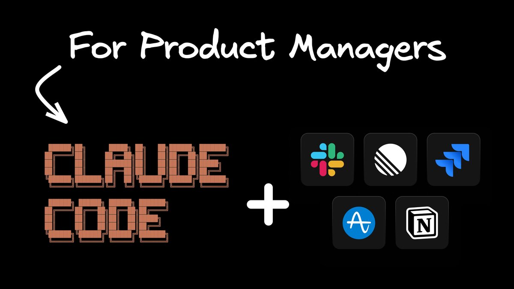
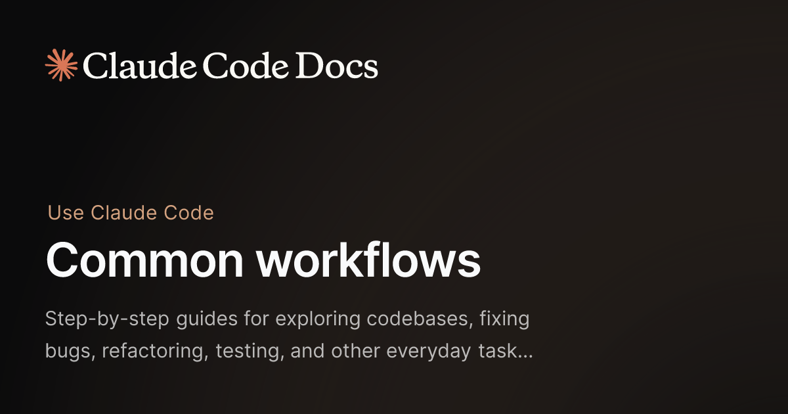
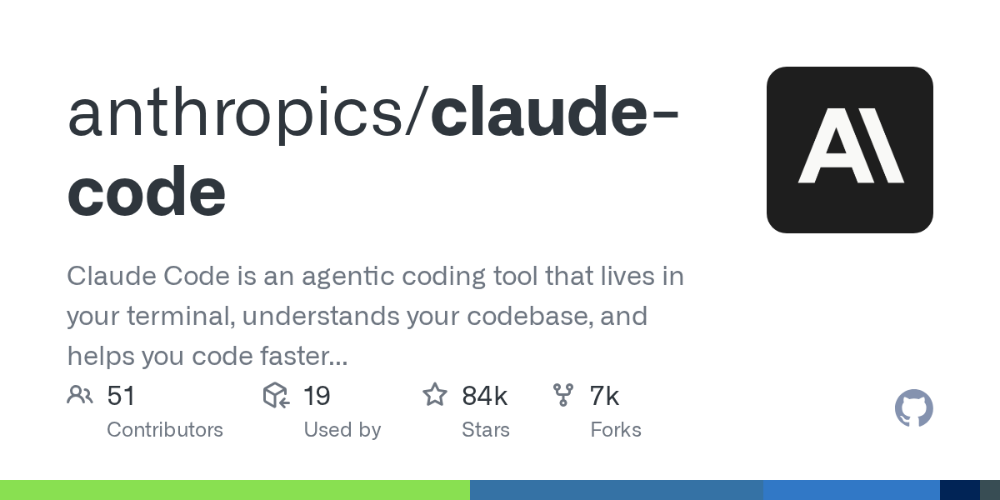

# Claude Code 最狠的地方，不是会写代码，而是开始重构产品经理的整条工作流

很多人一看到 Claude Code，第一反应还是：

这不就是给程序员用的吗？

但最近越来越多内容开始说明一件事：

**Claude Code 真正开始改变的，可能不只是程序员，而是产品经理这种“本来不写太多代码、但工作流极度依赖上下文和中间劳动”的岗位。**

这也是这篇内容最值得看的地方。

它表面在讲 Claude Code 的产品经理怎么用 AI。

但更深一层，它其实在讲：

> **AI 正在从一个辅助工具，变成工作流参与者。**

## 以前 AI 帮的是一个动作，现在 AI 开始接整条链

过去产品经理用 AI，更多是这样：

- 写个 PRD 初稿
- 改一段文案
- 总结一次会议
- 头脑风暴几个标题
- 把一堆资料压成要点

这些当然有用。

但它本质上还是“单点提效”。

你让 AI 帮一下某个动作，它帮完就结束了。

而现在不一样了。

Claude Code 这类工具正在把 AI 带进产品经理更完整的工作链条里：

- 拆需求
- 整理背景
- 归纳用户反馈
- 写结构化说明
- 生成方案草稿
- 接着推进实现
- 再把产出接回协作流程里

也就是说，AI 开始吞掉的，不再只是某个瞬时动作。

而是工作中大量重复、耗时、上下文密集的“中间层劳动”。

## 真正被重构的，不是效率，而是角色分工

这也是很多人最容易看轻的一点。

大家一说 AI 提效，脑子里还是老逻辑：

- 原来做一件事要 3 小时
- 现在 1 小时做完
- 所以效率提升了

但如果只这么理解，还是太浅。

Claude Code 这类工具更大的变化是：

**产品经理的角色边界开始重新划分。**

以前很多活，产品经理得自己亲手串：

- 看文档
- 拉背景
- 补逻辑
- 想结构
- 改表达
- 跟工程对齐
- 再把需求翻译成更可执行的东西

现在 AI 一旦能稳定进入上下文，它就会开始承担大量中间层工作。

于是人的价值，会越来越集中在：

- 判断问题值不值得做
- 确定方向对不对
- 做取舍
- 识别风险
- 决定最后怎么推进

说白了：

> **人越来越像导演，AI 越来越像执行中台。**

## Claude Code 最强的不是会写代码，而是能接住上下文

很多人到现在还把 Claude Code 理解成“终端里的写代码工具”。

这种理解不算错，但太窄了。

它真正厉害的地方，不只是会写代码。

而是它开始能更自然地接住：

- 项目背景
- 文档结构
- 历史决策
- 工作流上下文
- 文件之间的关联
- 任务推进的连续性

这对产品经理尤其重要。

因为产品经理很多工作不是难在“不会写一句话”，而是难在：

- 信息散
- 背景多
- 来回沟通成本高
- 历史包袱重
- 上下游很长

AI 一旦能接住这些上下文，它就不再像一个一次性问答框。

它会越来越像一个真正的工作搭子。

这也是为什么这类工具一旦成熟，很多岗位会感受到的不是“多了个助手”，而是：

**整个工作方式开始变了。**

## 对产品经理最残酷的地方：以后拼的不只是经验，还包括怎么调度 AI

我觉得这才是这篇背后最狠的地方。

未来产品经理之间的差距，很可能不只在：

- 谁更会写 PRD
- 谁更会做需求分析
- 谁更会对齐团队

而在：

**谁更会把 AI 接进自己的工作流。**

这会把人分成两类。

### 第一类人
还是把 AI 当搜索框、润色器、文案机。

### 第二类人
已经开始让 AI 参与：

- 调研
- 资料整理
- 结构化输出
- 协作推进
- 实现对接
- 复盘沉淀

这两类人的差距，一开始可能只是“快一点”。

但时间一长，差距就不是一点点了。

因为后者不是在省一两小时。

而是在**把整条工作链的摩擦系数降下来**。

## 这类工具真正重构的，不是写作，而是中间体

这是我看完之后最强的一个感受。

Claude Code 这类工具真正吃掉的，不是最后那个成品本身。

而是中间那一大坨过去必须由人手动整理、搬运、归纳、转译的东西。

而产品经理恰恰是最依赖这些中间体的岗位之一。

比如：

- 需求从口头变成文档
- 文档从散点变成结构
- 结构从思路变成协作对象能执行的版本
- 反馈从碎片变成结论
- 项目从“感觉不对”变成“问题到底在哪”

这些东西，过去特别吃经验，也特别吃耐心。

现在 AI 一旦能吃进上下文、理解文件、参与连续工作，它就会开始系统性吞掉这些中间体劳动。

这才是这类工具最该被重视的地方。

## 我对这件事的判断

一句话：

> **Claude Code 对产品经理最狠的改变，不是让你也能写点代码，而是让 AI 开始接手你工作里大量原本必须自己扛的中间劳动。**

一旦这件事跑通，产品经理这个岗位的工作方式一定会变。

不是岗位马上消失。

而是岗位的价值中心会迁移：

- 从“谁更能手动串完流程”
- 转向“谁更能定义问题、调度 AI、做关键判断”

## 最后

所以这篇文章真正值得看的，不是“Claude Code 产品经理也能用”。

这句话太浅了。

真正值得看的，是它背后那条更大的线：

**AI 正在从工具升级成工作流参与者，而产品经理这种高度依赖上下文、协作和中间劳动的岗位，会最先感受到这种重构。**

以前我们说 AI 帮人提效。

以后越来越多岗位会发现，AI 不是只帮你提效。

它在改写你到底怎么工作。

这才是最该被高看一眼的地方。

以上，既然看到这里了，如果觉得不错，随手点个赞、在看、转发三连吧，如果想第一时间收到推送，也可以给我个星标⭐～谢谢你看我的文章，我们，下次再见。
