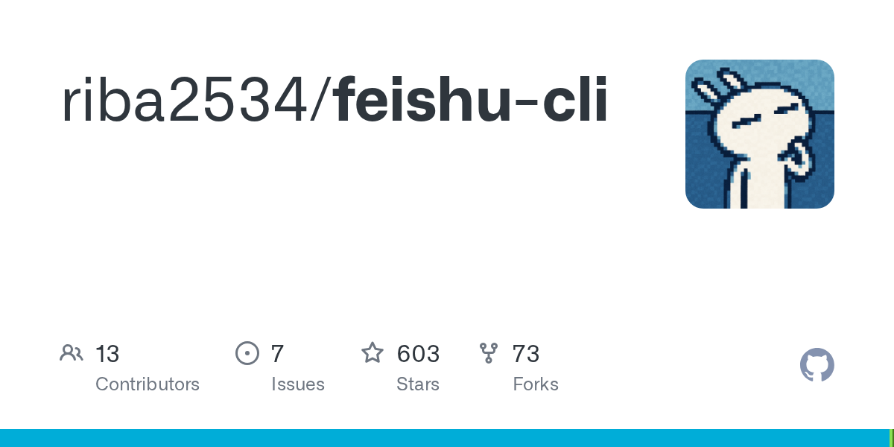

# 飞书 CLI 开源了，真正值得高看的不是“能操作飞书”，而是图形界面又被 AI 吃掉一块

刚看到这条消息时，很多人的第一反应可能是：

哦，飞书也有 CLI 了。

但如果只看到这里，其实还是看浅了。

这件事真正值得高看的一点，不是“以后可以在命令行里操作飞书”。

而是：

> **AI 正在把原本属于图形界面的软件能力，一块一块搬回到自然语言和命令层。**

这才是更大的变化。

## 以前我们用软件，是人去点；以后越来越像人发一句话，AI 去干

飞书这种工具，本来就是典型的图形界面产品。

你平时在里面做的动作，大概都是这些：

- 打开文档
- 找表格
- 建任务
- 看群消息
- 查知识库
- 拉人协作
- 处理文件

过去这些动作都默认是：

**人自己进界面、自己点、自己翻、自己找。**

CLI 一开源，再加上 Claude Code 这类 agent 工具能接进来，事情的味道就开始变了。

它慢慢会变成：

- 你不是自己去点飞书
- 而是直接说一句话
- 然后 AI 去帮你进飞书、找内容、处理动作、返回结果

这就不是“多一个工具入口”那么简单了。

它意味着：

**飞书这类软件，开始从“给人操作的 GUI”，慢慢转成“给 AI 调度的能力层”。**

## 真正变化不是 Claude Code 能操控飞书，而是工作流开始被重排

很多人看到“Claude Code 也可以丝滑操控飞书”，注意力会全放在“哇，连起来了”。

但连接本身不是重点。

重点是：

**一旦 AI 能操作飞书，很多原本必须由人亲手做的中间工作，就开始有机会被重新分配。**

比如：

- 帮你整理飞书文档里的要点
- 帮你跨知识库找资料
- 帮你把 Markdown 导进文档
- 帮你更新表格、写块内容、整理协作信息
- 帮你从聊天、文档、任务之间来回穿梭

这些动作单看都不算惊天动地。

但它们有个共同点：

> **都属于工作流里特别碎、特别耗神、特别容易消耗人的“中间劳动”。**

而 AI 最擅长吞掉的，恰恰就是这种中间层。

## 为什么我说这事比“飞书有 CLI 了”更重要

因为这不是单个软件在多一个开发者接口。

它背后更大的信号是：

### 第一层：软件能力正在被 API 化、CLI 化

以前很多能力只属于图形界面。

现在越来越多软件都会开始补：

- API
- CLI
- automation hooks
- agent-friendly 接口

原因很简单。

AI 如果真要接管工作流，它不能只会聊天，它得能“动手”。

而一旦软件厂商开始主动提供这种能力，就说明他们也知道：

**未来的软件用户，不只是真人，也包括 AI。**

### 第二层：自然语言开始侵蚀 GUI

这个趋势其实已经越来越明显了。

以前你打开软件，是为了找到那个按钮。

以后你打开软件，可能只是为了确认结果。

真正的操作过程，会越来越多地被一句自然语言指令替代。

也就是说：

- 人负责表达目标
- AI 负责执行操作
- GUI 慢慢退到结果确认层

这才是最狠的地方。

## 对办公软件来说，这一步尤其危险

飞书、Notion、Slack、Google Workspace 这类工具，以前最大的价值之一，就是：

**把协作流程装进图形界面里。**

你打开它们，是为了：
- 找东西
- 看东西
- 改东西
- 对齐别人

但如果 AI 已经可以直接调用这些能力，那未来用户真正依赖的就不再只是界面了。

而是：

- 这些能力有没有被开放出来
- AI 能不能稳定调用
- 能不能真正接进连续工作流

这会让办公软件的竞争逻辑慢慢变化。

以后不只是比：
- 界面好不好用
- 协作文档强不强

还要比：
- **你的系统是不是足够 agent-friendly**
- **AI 接进来之后，会不会比人自己点更顺**

## 对普通人来说，这件事最可怕的地方是什么

很多人会觉得，这种事和开发者更相关。

其实不止。

因为一旦 AI 能自然地接进飞书这种日常协作工具，后面最先被改写的，不一定是工程师，而可能是各种“信息搬运型、流程串联型、协调驱动型”岗位。

比如：

- 运营
- 产品
- 助理
- PMO
- 中后台协同岗位

这些岗位大量价值，本来就建立在：

- 找信息
- 拼信息
- 转信息
- 对齐信息
- 更新状态
- 维护协作流

而当 AI 能同时看文档、看表格、看群消息、操作知识库时，它就不是单点工具了。

它会开始挑战整条工作链。

## 我对这件事的直接判断

一句话：

> **飞书 CLI 开源，真正重要的不是“Claude Code 可以操控飞书”，而是办公软件开始越来越像 AI 的执行环境，而不只是人的操作界面。**

这条线如果继续往前走，你后面会看到越来越多软件都朝一个方向收：

- 更容易被 agent 调用
- 更容易被自动化串起来
- 更容易从“软件界面”退成“能力底座”

这会改变的不只是某个工具。

而是整个工作方式。

## 最后

很多人现在看 AI 进办公软件，还停留在“能不能自动写文档、自动回消息、自动做表格”。

这些都只是表层。

真正更大的变化是：

**GUI 这层原本由人来回点击、切换、查找、复制、整理的劳动，正在被自然语言和 agent 工作流一点点接管。**

飞书 CLI 这件事值钱，就值钱在它不是孤立功能。

它是这条趋势里的又一个确认信号：

**以后越来越多软件，不只是给人用，也是在给 AI 用。**

而一旦这件事彻底跑通，很多人每天打开软件的方式，都会变。

以上，既然看到这里了，如果觉得不错，随手点个赞、在看、转发三连吧，如果想第一时间收到推送，也可以给我个星标⭐～谢谢你看我的文章，我们，下次再见。
