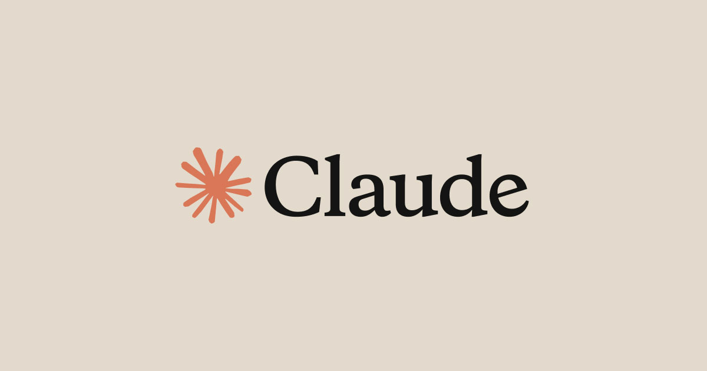

# AI 大模型竞争，已经不只是技术战争，而是正式进入收入战争

这两天 AI 圈有一个很值得高看的信号。

不是谁又发了一个新模型。

也不是谁在跑分榜上又赢了半个身位。

而是：

**OpenAI 的年化收入已经冲到 250 亿美元级别，而 Anthropic 也被曝逼近 190 亿美元。**

如果这组数字成立，那 AI 大模型行业正在发生一个很明显的变化：

> **竞争的主战场，开始从“谁更强”，转向“谁更能把能力变成钱”。**

这不是一个小变化。

因为它意味着，大模型行业已经在从“技术故事”正式往“商业战争”切换。

## 以前大家比的是模型能力，现在开始比收入曲线

过去一年多，AI 行业最热的讨论基本都集中在这些词上：

- 推理
- 多模态
- 长上下文
- agent
- 编码能力
- benchmark
- 训练规模

这些东西当然重要。

但它们有一个共同点：

**都还属于“技术竞争”的范畴。**

而收入不一样。

收入是更冷酷的东西。

因为收入会逼所有公司回答一个更现实的问题：

- 用户到底愿不愿意持续付钱？
- 企业到底愿不愿意长期采购？
- API 调用是不是能变成稳定现金流？
- Claude Code、ChatGPT、企业版套餐、推理服务，哪些才是真正的赚钱机器？

一旦市场开始盯这些，大模型公司的故事就会变得没那么浪漫。

因为到最后，资本不会只看你模型多强。

它会看：

**你到底能不能把这种强，稳定地卖出去。**

## 为什么这件事比“技术升级”更重要

因为技术升级这件事，很多时候会被高估。

你模型更强一点，可能会带来：
- 更好的口碑
- 更高的估值
- 更强的叙事

但不一定立刻带来更强的现金流。

而收入增长不一样。

收入一旦上来，就说明至少有一件事开始成立：

> **AI 不再只是资本和媒体追捧的概念，它已经在被越来越大规模地买单。**

这会直接改变行业的关注点。

以后大家会越来越关心：

- 谁的企业收入更稳
- 谁的开发者生态更强
- 谁的高价值产品能持续收费
- 谁的推理成本能撑住毛利
- 谁的高增长是不是“真钱”，不是虚火

这就是为什么我说，这波信号的意义不在数字本身，而在阶段变化。

## OpenAI 和 Anthropic 现在开始打的，不只是模型仗，而是商业仗

如果只看技术，两家当然一直都在卷。

但现在收入数字一出来，味道就变了。

### OpenAI 代表的是什么？

OpenAI 更像是：
- To C 规模化入口
- ChatGPT 巨大用户池
- API + 产品双线推进
- 模型发布能力强
- 商业故事更大、更外向

### Anthropic 代表的是什么？

Anthropic 更像是：
- 企业市场渗透更深
- 安全、可靠、工作流集成叙事更强
- Claude Code 这类产品正在变成新增长引擎
- 高客单价企业收入含金量更高

所以现在这场竞争，已经不只是：

“谁模型更聪明？”

而是开始变成：

“谁更能把模型能力变成持续收入？”

这才是这组数字最吓人的地方。

## 收入战争一开打，行业逻辑就会变

这一步一旦成立，AI 行业后面会越来越明显地出现几个变化。

### 第一：发布会的意义会变小

以后不是每次模型发布都能轻松点燃市场了。

因为市场会越来越追问：

- 这次升级有没有带来更多付费用户？
- 企业客户会不会真的扩大采购？
- 使用量增长能不能跑赢成本增长？

也就是说，单纯的“模型更强了”，慢慢不够了。

### 第二：产品会比模型更重要

模型是底座，但赚钱往往发生在产品层。

比如：
- ChatGPT
- Claude Code
- 企业版工作流接入
- 行业解决方案
- 高价值 API 场景

所以后面真正拉开差距的，不一定只是训练能力。

而是：

**谁更快把模型封装成真正有人持续买单的产品。**

### 第三：成本和毛利会越来越重要

收入数字好看不代表利润好看。

如果一家公司收入暴涨，但推理、训练、补贴、云成本也一起炸，那市场迟早会开始算账。

这就是为什么我说，收入战争一开始，行业就没那么“梦幻”了。

它会越来越像一场硬仗。

## 这对 AI 行业意味着什么

如果你把这件事放大一点看，会发现它其实在给整个行业定调：

> **AI 正在从“谁最会讲未来故事”，进入“谁最能兑现商业现实”的阶段。**

这会带来两个直接结果。

### 结果一：行业分化会加速

以后不是所有模型公司都能活得舒服。

因为技术上能做出模型，不代表商业上能养活模型。

真正能留下来的，往往会是两类：
- 有超级入口的
- 有稳定企业收入的

中间那批“模型看起来不错，但商业化不够扎实”的公司，后面压力会越来越大。

### 结果二：资本会变得更挑剔

以前大家还能先冲估值、后看落地。

但收入战争一打起来，投资人一定会更关心：
- 复购率
- 留存
- 客单价
- 增长质量
- 收入确认口径

这也是为什么最近已经开始有人追问：

**OpenAI 和 Anthropic 的收入口径到底怎么比？**

这件事本身就很说明问题。

因为行业现在已经开始从看热闹，进入算总账阶段了。

## 我对这波信号的判断

一句话：

> **AI 大模型竞争，已经不只是技术战争，而是正式进入收入战争。**

而收入战争一旦开始，行业的重心就会慢慢变化：

- 从模型参数转向商业结果
- 从能力展示转向产品变现
- 从技术兴奋转向成本与毛利
- 从“谁最强”转向“谁最能长期赚钱”

这一步一旦被市场确认，很多公司后面的估值逻辑都会变。

## 最后

过去这轮 AI 热潮里，最容易被讨论的是模型、跑分、发布会、爆款产品。

但我越来越觉得，真正会决定下一阶段格局的，未必是这些最热闹的表层信号。

而是更冷、更硬、更现实的东西：

- 收入
- 现金流
- 企业采购
- 毛利
- 复购
- 商业结构

所以这次 OpenAI 和 Anthropic 收入数字被摆上台面，真正值得看的不是“谁现在更猛”。

而是：

**AI 这场仗，已经开始从技术秀场，走进商业战场。**

这一步，才是真正会改变行业格局的地方。

以上，既然看到这里了，如果觉得不错，随手点个赞、在看、转发三连吧，如果想第一时间收到推送，也可以给我个星标⭐～谢谢你看我的文章，我们，下次再见。
