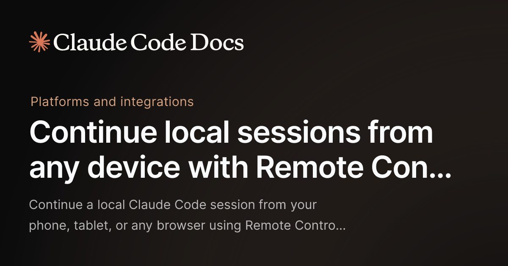
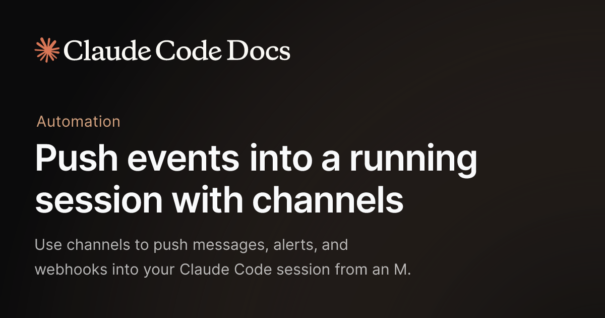
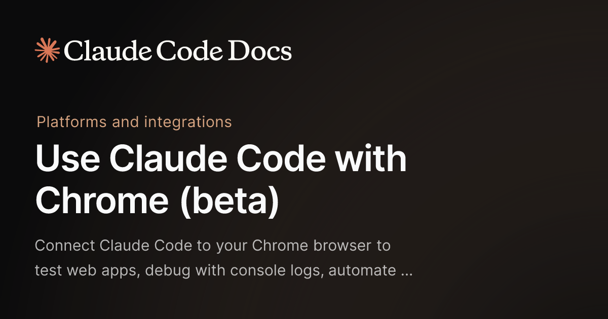

# Claude Code 这波最狠的，不是15个新功能，而是它开始像一个真正能持续运转的AI系统

如果只看标题，很多人会把这件事理解成：

Claude Code 创始人又分享了 15 条新技巧。

但真把这波更新摊开看，会发现重点根本不是“技巧”。

而是：

> **Claude Code 正在从一个终端里的 AI 编程工具，变成一个可以跨设备、可远程调度、能持续运行、还能接收外部消息的 Agent 系统。**

这不是小升级。

这是边界在变。

## 真正值得看的，不是功能数量，而是能力的方向变了

如果只是多了 15 个命令，没什么好大惊小怪的。

问题在于，这次放出来的一批能力，明显不是“把终端再打磨一下”这么简单。

它们在一起指向的是同一个方向：

- **Claude Code 不再被桌面绑定**
- **Claude Code 不再只在你盯着它的时候工作**
- **Claude Code 不再只是“你问一句，它回一句”**
- **Claude Code 开始可以被远程调度、持续运行、并且接收外部世界的事件**

这就不是工具微调了。

这已经开始接近一个真正的 Agent runtime。

## 先看最关键的三个变化

### 1. 远程控制：Claude Code 开始从“终端工具”变成“可远程调用的工作体”

这一点很关键。

以前你用 Claude Code，本质上还是在本地终端里和它协作。

你离开电脑，基本就断了。

但现在有了 **Remote Control** 之后，它的味道变了。

你不一定非得坐在那台机器前，才能继续那次会话。

这意味着什么？

意味着 Claude Code 开始更像：

- 一段持续运行的工作进程
- 一个可以被远程唤起的执行体
- 一个你不在桌面前，也能继续接着推进的 AI 工作者

这一步一旦走通，编程工具和 Agent 的边界就会开始模糊。

## 2. Channels：消息开始能直接推进正在运行的会话

这是我觉得最狠的一个点。

Channels 本质上不是“多一个聊天入口”这么简单。

它的真正意义是：

> **外部消息，开始可以直接推进一个已经在运行的 Claude Code 会话。**

也就是说，你在外面，通过 Telegram、Discord、iMessage 之类的渠道发一句话，不是新建一个聊天，而是把消息推到那个已经在跑的会话里。

这个味道就完全不一样了。

因为它意味着 Claude Code 这类工具开始具备一种更强的连续性：

- 会话不是一次性的
- 任务不是封闭的
- 外部世界可以随时把新事件推给它
- 它可以在原有上下文里继续干

这已经很像“一个挂在后台、随时可被你戳一下继续工作的 AI 同事”了。

## 3. /loop、/schedule、批量执行：AI 开始不只会响应，还会持续运转

这批更新里另一个特别值得高看的点，是自动化这一层被明显加强了。

像：
- `/loop`
- `/schedule`
- `/batch`
- Git worktrees
- Dispatch / branch / btw 这类围绕多任务、多线程、多上下文的能力

它们放在一起看，不是零碎技巧。

它们表达的是一个更大的变化：

**Claude Code 不再只是一个一次性应答器，而是在往可持续执行系统走。**

以前 AI 编程更多像：
- 你盯着
- 你发指令
- 它做一步
- 你再确认

现在越来越像：
- 你给一个方向
- 它持续跑
- 它定时做
- 它并行干
- 它把不同任务拆开处理

这就不只是效率工具了。

而是在重写工作流。

## 语音、移动端、Chrome：交互入口也在变

这波更新里，很多人最容易忽略的一点，是交互入口正在被重新定义。

以前编程这件事，默认是：
- 桌面
- 键盘
- 终端
- IDE

但现在你会看到：
- `/voice`
- Remote Control
- Chrome 集成
- 消息渠道接入

这些能力一起出现，说明一个很清楚的趋势：

> **AI 编程工具开始不再把“桌面终端”当成唯一主场。**

这件事后面很可能会越来越重要。

因为一旦工具能在：
- 手机
- 浏览器
- 外部消息
- 本地终端
- 多设备

这些地方同时接住同一个会话，那使用方式就变了。

你不再只是“坐下来写代码”。

你会越来越像在**调度一个会持续工作的系统**。

## 这不是“技巧升级”，而是在重写 AI 编程工具的边界

我觉得这件事最值得高看的地方就在这。

很多人看这些更新，还是会用老眼镜去看：

- 多了几个命令
- 多了几个小功能
- 更好用了

但如果你把这批能力放在一起，就会发现它们不是孤立功能。

它们共同指向的是：

> **Claude Code 正在从“一个终端里的 AI 助手”，进化成“一个可远程触发、可持续运行、可接收外部事件、可多任务并行的 Agent 系统”。**

这句话很长，但它是这波更新真正的重点。

因为这意味着它开始碰到的，不再只是“怎么帮你写代码更快”。

而是：

- 怎么持续工作
- 怎么跨场景存在
- 怎么和外部世界连接
- 怎么让任务不是一次性，而是可延续的

这才是边界变化。

## 这对整个行业意味着什么

如果 Claude Code 这条路走通，它影响的不只是 Anthropic 自己。

它会给整个 AI 编程工具赛道定一个更高的标准。

以后大家不会只看：
- 模型能不能写代码
- 终端好不好用
- IDE 插件顺不顺

而会越来越看：
- 能不能远程继续
- 能不能跨设备协作
- 能不能接外部消息
- 能不能持续跑任务
- 能不能批量并行

也就是说，AI 编程工具的竞争标准，正在从：

**谁更像一个增强版补全工具**

变成：

**谁更像一个真正能持续工作的 Agent 系统。**

## 我对这波更新的判断

一句话：

> **Claude Code 这次最狠的，不是15个新功能，而是它开始从工具形态走向系统形态。**

这一步最可怕的地方，不在于它今天已经多成熟。

而在于它把方向暴露得很清楚了：

- 从响应式走向持续式
- 从本地走向跨设备
- 从单点交互走向外部消息接入
- 从一次性协作走向后台常驻工作流

这条线如果继续走下去，未来你看到的就不再只是“会写代码的 AI”。

而是一个：

**可以被你远程唤起、持续运行、随时追加任务、还能自己在后台推进工作的 AI 系统。**

## 最后

很多人还在把 Claude Code 这类产品当成“终端里的 ChatGPT”。

但看完这波更新，我越来越觉得，这种理解已经开始落后了。

真正值得看的，不是它会不会给你生成更好的一段代码。

而是：

**它正在从一个工具，慢慢变成一个能持续运转、可被调度、可被连接、可被扩展的工作系统。**

这一步一旦走通，影响的就不只是编程体验。

而是整个 AI 工作流的边界。

以上，既然看到这里了，如果觉得不错，随手点个赞、在看、转发三连吧，如果想第一时间收到推送，也可以给我个星标⭐～谢谢你看我的文章，我们，下次再见。
