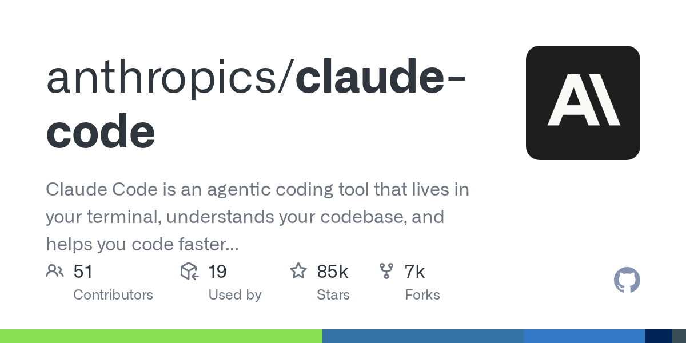
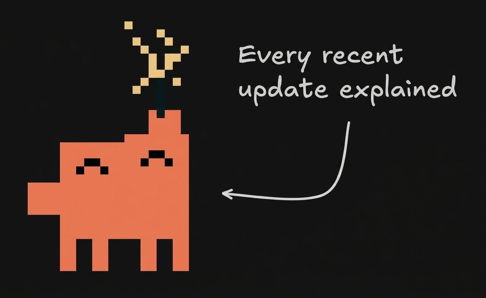

# Claude Code 这次“意外开源”，真正暴露出来的不是源码，而是下一代 AI Agent 产品该怎么做

这两天，AI 圈最热的瓜之一，就是 Claude Code 的源码泄露。

表面上看，这事很简单：

Anthropic 在 npm 包里误放了 source map，结果一大批 Claude Code 的 TypeScript 源码被人还原出来，随后 GitHub 上还出现了一个公开归档仓库：`instructkr/claude-code`。

这件事当然很炸。

- 超过 1900 个文件
- 超过 51 万行代码
- React + Ink 终端 UI
- Bun 运行时
- 多 Agent、桥接层、技能系统、记忆系统、远程控制等大量细节被看光

但如果只把它当成一次“翻车事故”来看，其实有点浪费了。

因为这次最值得看的，不是 Anthropic 丢了多少代码。

而是：

> **Claude Code 这次“意外开源”，第一次让很多人更具体地看到，一个真正好用的 AI Agent 产品，到底是怎么被工程化出来的。**

## 真正被暴露出来的，不只是代码，而是 harness engineering

这次我看完相关文章，再看那个公开归档仓库，最大的感受就一句话：

> **Claude Code 好用，不只是因为模型强，更是因为 Anthropic 把模型外面的整套系统做得很深。**

现在有个词越来越重要，叫 **harness engineering**。

说白了就是：

AI 产品的体验，不只取决于模型有多强，还取决于你围绕模型搭了什么“笼具”。

这个“笼具”包括：
- system prompt 怎么拼
- 工具怎么挂
- 权限怎么审
- 记忆怎么存
- 上下文怎么压
- 多 agent 怎么协作
- 长任务怎么延续
- 安全边界怎么收口

模型像大脑。

但 harness 才像骨架、神经、肌肉、门禁和工作制度。

没有这一层，模型再强，也很容易变成：
- 聪明但不稳
- 有能力但不好使
- 偶尔惊艳，但不敢真交任务

而 Claude Code 这次泄露出来的，恰恰就是这层最关键的东西。

## 第一层启发：好用的 AI，不是只靠 prompt，而是靠“上下文工厂”

很多人平时用 AI，还是停留在“我输入一句话，它回我一句话”的理解。

但 Claude Code 这类产品显然不是这样。

你看到的可能只是一个终端输入框。

但在背后，系统会拼接大量上下文：
- 身份定义
- 安全规则
- 工具使用约束
- 风格规则
- 当前目录信息
- Git 状态
- MCP 服务说明
- 用户记忆
- 项目配置

也就是说，用户的一句话，只是最后那一下点火。

真正决定输出质量的，是前面那一整套上下文工程。

这件事对所有做 AI 产品的人都很重要。

因为它说明：

> **AI 的交付质量，很多时候不是 prompt 写得漂不漂亮，而是系统有没有把该给它的上下文准备好。**

## 第二层启发：真正能商用的 Agent，一定不是裸奔的

Claude Code 被拆出来之后，一个很值得高看的点，是它的权限和安全设计。

很多人对 Auto Mode 的直觉是：
- 自动模式 = 放权给 AI 自己干

但真实情况显然没那么粗暴。

相关分析里提到，它背后其实有独立的权限分类流程，甚至有“第二个 AI”来帮忙做安全判断。

大概逻辑就是：
- 哪些能直接放行
- 哪些需要软确认
- 哪些必须硬拦截
- 连续被拒太多次还会降级

这件事很关键。

因为很多人一做 Agent，就容易走两个极端：
- 要么权限太死，AI 什么都干不了
- 要么权限太松，AI 到处乱动

真正成熟的产品，不会选其中一个极端。

它会做一套细分、分层、可回退的护栏系统。

也就是说：

> **让 AI 真正可用的，不是“敢放权”，而是“知道怎么在放权的同时保住边界”。**

## 第三层启发：记忆最值钱的，不是记事实，而是记偏好

这次相关文章里提到一个我很认同的点：

Claude Code 的记忆系统，很强调**记偏好，不记代码定位**。

这背后的判断非常成熟。

因为代码是会变的。

你把某个函数、某行位置、某个文件状态硬记下来，很容易过几轮就失真。

但人的偏好往往更稳定：
- 你喜欢什么语言
- 你偏好什么风格
- 你讨厌什么表达
- 你做事时更看重什么

这种东西记下来，才会越用越准。

这对所有 AI 产品其实都是个提醒：

> **长期记忆不该优先记“会过期的细节”，而该优先记“更稳定的偏好和原则”。**

## 第四层启发：长上下文不是“总结一下”，而是结构化压缩

这次另一个特别值钱的点，是上下文压缩方式。

很多人做多轮对话，压缩历史的时候就一句：
- 帮我总结一下之前聊了什么

这其实很不稳。

Claude Code 这类产品更像是把上下文压缩当成一个正式模块来设计。

也就是说，压缩不是自由发挥，而是按结构保留：
- 核心请求
- 当前工作
- 错误和修复
- 待办项
- 下一步动作
- 用户原话
- 关键文件与概念

这意味着什么？

意味着好的 AI 记忆延续，不是靠“总结能力”，而是靠“信息结构”。

这点特别像做知识管理。

你不是简单减少字数，而是确保最容易影响后续行为的信息，不会被压缩掉。

## 第五层启发：多 Agent 真正难的，不是分身，而是组织管理

公开仓库和相关文章里，还有一个非常值得看的方向：

Claude Code 的多 Agent 不是玩具式的“分几个任务跑一跑”。

它更像真的在模拟一个组织：
- 有 leader
- 有 teammate
- 有任务分配
- 有异步通信
- 有权限冒泡
- 有 worktree 隔离

这背后其实不是“会不会多开几个 agent”的问题。

而是：

> **你有没有把多 Agent 当成一个组织系统来设计，而不是一个 demo 功能。**

这个差别非常大。

因为多 Agent 一旦进真实工作流，马上就会遇到：
- 谁来拆任务
- 谁来合并结果
- 谁来兜底确认
- 谁有权限执行危险操作
- 怎么避免互相踩文件

这些问题，全都不是模型问题，而是系统问题。

## 第六层启发：真正的护城河，越来越不只是模型

这次我最大的感受其实是这个。

很多人还在用旧思路看 AI 产品，觉得核心就是：
- 谁模型更强
- 谁参数更大
- 谁跑分更高

但 Claude Code 这次“意外开源”恰恰让人更清楚地看到：

**真正拉开体验差距的，很大一部分已经不在模型本身，而在模型外面的工程系统。**

同样是调用强模型：
- 有的产品像聊天框
- 有的产品像半成品工具
- 有的产品已经开始像真正的工作系统

差异就出在 harness 上。

所以这件事对行业最有价值的地方，不是吃瓜。

而是它意外证明了一件事：

> **下一代 AI Agent 产品的竞争，正在从“谁模型更强”转向“谁把系统做得更完整”。**

## 那个 GitHub 归档仓库，为什么也值得看

你后面发的这个项目：`https://github.com/instructkr/claude-code`

它本身也说明了一个现实：

这次事情已经不只是“一个 npm 包失误”这么简单了。

因为一旦源码被镜像、被归档、被多人备份，事情就很难靠删包完全收回去。

而这个仓库 README 里也明确把它包装成：
- source exposure archive
- security research
- architecture review
- build artifact leak study

也就是说，围观已经开始从“看热闹”变成“做研究”。

从传播角度看，这很正常。

从行业角度看，这也很有代表性。

因为 AI 工具一旦进入工程化和供应链分发阶段，它面对的就不只是模型安全，还包括：
- 构建流程
- 发布流程
- 调试文件暴露
- 包管理器分发风险
- 源码还原
- 第三方归档传播

这其实是一个很现实的提醒：

> **AI 时代最大的风险，很多时候不是 AI 太强，而是工程链路里一个非常普通的人类失误。**

## 我对这件事的判断

一句话：

> **Claude Code 这次“意外开源”，真正暴露出来的不是源码，而是下一代 AI Agent 产品到底该怎么做。**

如果只看热闹，你会得到一个结论：
- Anthropic 又翻车了

但如果看门道，你会看到更重要的东西：
- 上下文工程
- 安全分类
- 记忆设计
- 压缩结构
- 多 Agent 组织
- 系统护栏
- 工具层架构

这些东西，才是决定一个 AI coding agent 能不能从“看起来很强”走到“真能长期稳定干活”的关键。

## 最后

这次事件很戏剧化。

标题当然可以写得很炸：
- 越狱
- 永生
- 开源
- 51 万行裸奔

这些都能吸引眼球。

但我觉得真正值得被记住的，不是这层戏剧性。

而是：

**Anthropic 这次无意中给整个行业公开了一堂课。**

这堂课讲的不是怎么训练更强模型。

而是怎么把一个强模型，做成一个：
- 更稳
- 更可控
- 更能持续工作
- 更像系统而不是工具

的 AI Agent 产品。

这才是这次事件真正有价值的地方。

以上，既然看到这里了，如果觉得不错，随手点个赞、在看、转发三连吧，如果想第一时间收到推送，也可以给我个星标⭐～谢谢你看我的文章，我们，下次再见。
